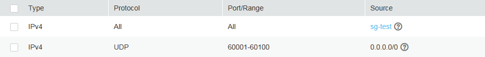

# How Can I Configure a Security Group for Multi-Channel Protocols?

## ECS Configuration

The TFTP daemon determines whether the configuration file specifies the port range. If you use the TFTP configuration file that allows the data channel ports to be configurable, it is a best practice to configure a small range of ports that are not listened on.

## Security Group Configuration

You can configure both port 69 and the data channel ports used by TFTP for the security group. In RFC1350, the TFTP protocol specifies that ports available to data channels range from 0 to 65535. However, not all these ports are used by the TFTP daemon processes of different applications. Therefore, you can configure a small range of ports for the TFTP daemon.

The following figure provides an example of the security group rule configuration if the ports used by data channels range from 60001 to 60100.

**Figure  1**  Security group rules  

