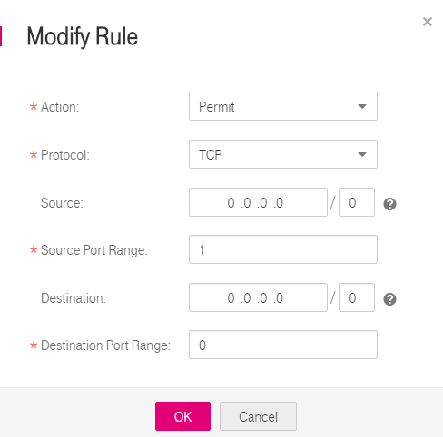

# Modifying a Firewall Rule

## Scenarios

Modify an inbound or outbound firewall rule based on your network security requirements.

## Procedure

1.  Log in to the management console.
2.  Click    in the upper left corner and select the desired region and project.
3.  On the console homepage, under  **Network**, click  **Virtual Private Cloud**.
4.  In the navigation pane on the left, choose  **Access Control**  \>  **Firewalls**.
5.  Locate the target firewall in the right pane, and click the firewall name to switch to the page showing details of that particular firewall.
6.  On the  **Inbound Rules**  or  **Outbound Rules**  tab, locate the target rule and click  **Modify**  in the  **Operation**  column. In the displayed dialog box, configure parameters as prompted.  [Table 1](#table59686157164549)  lists the parameters to be configured.

    **Figure  1**  Modify Rule  
    

    **Table  1**  Parameter description

    
    <table><thead align="left"><tr id="en-us_topic_0051746702_row245764813417"><th class="cellrowborder" valign="top" width="19.89%" id="mcps1.2.4.1.1">
Parameter

    </th>
    <th class="cellrowborder" valign="top" width="57.769999999999996%" id="mcps1.2.4.1.2">
Description

    </th>
    <th class="cellrowborder" valign="top" width="22.34%" id="mcps1.2.4.1.3">
Example Value

    </th>
    </tr>
    </thead>
    <tbody><tr id="en-us_topic_0051746702_row184641148133419"><td class="cellrowborder" valign="top" width="19.89%" headers="mcps1.2.4.1.1 ">
Action

    </td>
    <td class="cellrowborder" valign="top" width="57.769999999999996%" headers="mcps1.2.4.1.2 ">
Specifies the action in the firewall. This parameter is mandatory. You can select a value from the drop-down list. Currently, the value can be <strong id="en-us_topic_0051746702_b67011216115318">Permit</strong> or <strong id="en-us_topic_0051746702_b15652620205314">Deny</strong>.

    </td>
    <td class="cellrowborder" valign="top" width="22.34%" headers="mcps1.2.4.1.3 ">
Permit

    </td>
    </tr>
    <tr id="en-us_topic_0051746702_row0466148153411"><td class="cellrowborder" valign="top" width="19.89%" headers="mcps1.2.4.1.1 ">
Protocol

    </td>
    <td class="cellrowborder" valign="top" width="57.769999999999996%" headers="mcps1.2.4.1.2 ">
Specifies the protocol supported by the firewall. This parameter is mandatory. You can select a value from the drop-down list. The value can be <strong id="en-us_topic_0051746702_b93582612531">TCP</strong>, <strong id="en-us_topic_0051746702_b537626155316">UDP</strong>, <strong id="en-us_topic_0051746702_b198561298545">All</strong>, or <strong id="en-us_topic_0051746702_b43815260538">ICMP</strong>. If <strong id="en-us_topic_0051746702_b2381826165313">ICMP</strong> or <strong id="en-us_topic_0051746702_b153992685310">All</strong> is selected, you do not need to specify port information.

    </td>
    <td class="cellrowborder" valign="top" width="22.34%" headers="mcps1.2.4.1.3 ">
TCP

    </td>
    </tr>
    <tr id="en-us_topic_0051746702_row7466248203412"><td class="cellrowborder" valign="top" width="19.89%" headers="mcps1.2.4.1.1 ">
Source

    </td>
    <td class="cellrowborder" valign="top" width="57.769999999999996%" headers="mcps1.2.4.1.2 ">
Specifies the source IP address that the traffic is allowed from.

    
The default value is <strong id="en-us_topic_0051746702_b842352706231637">0.0.0.0/0</strong>, which indicates that traffic from all IP addresses is allowed.

    
For example:

    
xxx.xxx.xxx.xxx/32 (IP address)

    
xxx.xxx.xxx.0/24 (CIDR block)

    
0.0.0.0/0 (any IP address)

    </td>
    <td class="cellrowborder" valign="top" width="22.34%" headers="mcps1.2.4.1.3 ">
0.0.0.0/0

    </td>
    </tr>
    <tr id="en-us_topic_0051746702_row446624812347"><td class="cellrowborder" valign="top" width="19.89%" headers="mcps1.2.4.1.1 ">
Source Port Range

    </td>
    <td class="cellrowborder" valign="top" width="57.769999999999996%" headers="mcps1.2.4.1.2 ">
Specifies the source port number or port number range. The value ranges from 1 to 65535. For a port number range, enter two port numbers connected by a hyphen (-). For example, <strong id="en-us_topic_0051746702_b51691441981">1-100</strong>.

    
You must specify this parameter if <strong>TCP</strong> or <strong>UDP</strong> is selected for <strong>Protocol</strong>.

    </td>
    <td class="cellrowborder" valign="top" width="22.34%" headers="mcps1.2.4.1.3 ">
22 or 22-30

    </td>
    </tr>
    <tr id="en-us_topic_0051746702_row346764883414"><td class="cellrowborder" valign="top" width="19.89%" headers="mcps1.2.4.1.1 ">
Destination

    </td>
    <td class="cellrowborder" valign="top" width="57.769999999999996%" headers="mcps1.2.4.1.2 ">
Specifies the destination IP address to which the traffic is allowed.

    
The default value is <strong id="en-us_topic_0051746702_b842352706231637_1">0.0.0.0/0</strong>, which indicates that traffic to all IP addresses is allowed.

    
For example:

    
xxx.xxx.xxx.xxx/32 (IP address)

    
xxx.xxx.xxx.0/24 (CIDR block)

    
0.0.0.0/0 (any IP address)

    </td>
    <td class="cellrowborder" valign="top" width="22.34%" headers="mcps1.2.4.1.3 ">
0.0.0.0/0

    </td>
    </tr>
    <tr id="en-us_topic_0051746702_row646834823419"><td class="cellrowborder" valign="top" width="19.89%" headers="mcps1.2.4.1.1 ">
Destination Port Range

    </td>
    <td class="cellrowborder" valign="top" width="57.769999999999996%" headers="mcps1.2.4.1.2 ">
Specifies the destination port number or port number range. The value ranges from 1 to 65535. For a port number range, enter two port numbers connected by a hyphen (-). For example, <strong id="en-us_topic_0051746702_b15828242172719">1-100</strong>.

    
You must specify this parameter if <strong>TCP</strong> or <strong>UDP</strong> is selected for <strong>Protocol</strong>.

    </td>
    <td class="cellrowborder" valign="top" width="22.34%" headers="mcps1.2.4.1.3 ">
22 or 22-30

    </td>
    </tr>
    <tr id="en-us_topic_0051746702_row2641164215415"><td class="cellrowborder" valign="top" width="19.89%" headers="mcps1.2.4.1.1 ">
Description

    </td>
    <td class="cellrowborder" valign="top" width="57.769999999999996%" headers="mcps1.2.4.1.2 ">
Provides supplementary information about the firewall rule. This parameter is optional.

    
The firewall rule description can contain a maximum of 255 characters and cannot contain angle brackets (&lt; or &gt;).

    </td>
    <td class="cellrowborder" valign="top" width="22.34%" headers="mcps1.2.4.1.3 ">
N/A

    </td>
    </tr>
    </tbody>
    </table>

7.  Click  **OK**.

    The firewall rule is modified. The procedure for modifying an outbound firewall rule is the same as that for modifying an inbound rule.

