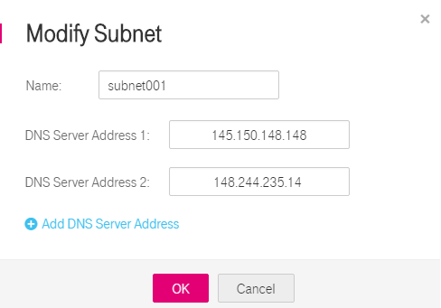

# Modifying a Subnet

## Scenarios

Change the subnet name, NTP server address, and DNS server address.

## Procedure

1.  Log in to the management console.
2.  Click    in the upper left corner and select the desired region and project.
3.  On the console homepage, under  **Network**, click  **Virtual Private Cloud**.
4.  In the navigation pane on the left, click  **Virtual Private Cloud**.
5.  On the  **Virtual Private Cloud**  page, locate the VPC for which a subnet is to be modified and click the VPC name.
6.  In the subnet list, locate the target subnet and click  **Modify**. Modify the parameters as prompted.

    **Figure  1**  Modify Subnet  
    

    **Table  1**  Parameter description

    
    <table><thead align="left"><tr id="r9fa5b742a4a3411f8c03962647a54613"><th class="cellrowborder" valign="top" width="32.22%" id="mcps1.2.4.1.1">
Parameter

    </th>
    <th class="cellrowborder" valign="top" width="43.1%" id="mcps1.2.4.1.2">
Description

    </th>
    <th class="cellrowborder" valign="top" width="24.68%" id="mcps1.2.4.1.3">
Example Value

    </th>
    </tr>
    </thead>
    <tbody><tr id="r4b7733c08f1b44efa71c70084ae18ba2"><td class="cellrowborder" valign="top" width="32.22%" headers="mcps1.2.4.1.1 ">
Name

    </td>
    <td class="cellrowborder" valign="top" width="43.1%" headers="mcps1.2.4.1.2 ">
Specifies the subnet name.

    
The VPC flow log name can contain a maximum of 64 characters, which may consist of letters, digits, underscores (_), hyphens (-), and periods (.). The name cannot contain spaces.

    </td>
    <td class="cellrowborder" valign="top" width="24.68%" headers="mcps1.2.4.1.3 ">
Subnet

    </td>
    </tr>
    <tr id="row08664184148"><td class="cellrowborder" valign="top" width="32.22%" headers="mcps1.2.4.1.1 ">
DNS Server Address

    </td>
    <td class="cellrowborder" valign="top" width="43.1%" headers="mcps1.2.4.1.2 ">
By default, two DNS server addresses are configured. You can change them as required. A maximum of five DNS server addresses can be configured. Multiple IP addresses must be separated using commas (,).

    </td>
    <td class="cellrowborder" valign="top" width="24.68%" headers="mcps1.2.4.1.3 ">
100.125.x.x

    </td>
    </tr>
    <tr id="row653864310412"><td class="cellrowborder" valign="top" width="32.22%" headers="mcps1.2.4.1.1 ">
NTP Server Address

    </td>
    <td class="cellrowborder" valign="top" width="43.1%" headers="mcps1.2.4.1.2 ">
Specifies the IP address of the NTP server. This parameter is optional.

    
You can configure the NTP server IP addresses to be added to the subnet as required. The IP addresses are added in addition to the default NTP server addresses. If this parameter is left empty, no IP address of the NTP server is added.

    
A maximum of four IP addresses can be configured. Multiple IP addresses must be separated using commas (,).

    
 NOTE: 
<ul id="en-us_topic_0118498970_ul75071540174811"><li>If you add or change the NTP server addresses of a subnet, you need to renew the DHCP lease for or restart all the ECSs in the subnet to make the change take effect immediately.</li><li>If the NTP server addresses have been cleared out, restarting the ECSs will not help. You must renew the DHCP lease for all ECSs to make the change take effect immediately.</li></ul>
    

    </td>
    <td class="cellrowborder" valign="top" width="24.68%" headers="mcps1.2.4.1.3 ">
192.168.2.1

    </td>
    </tr>
    </tbody>
    </table>

7.  Click  **OK**.

