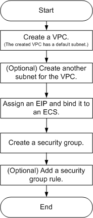

# Overview

If your ECSs need to access the Internet, for example, the ECSs functioning as the service nodes for deploying a website, you can follow the procedure shown in  [Figure 1](#fe457c1ec47c84d6fa3b87210d5b284eb)  to bind EIPs to the ECSs.

**Figure  1**  Configuring the network

[Table 1](#t5143cea7d59f4c31b1c56ab35e86f71f)  describes the different tasks in the procedure for configuring the network.

**Table  1**  Configuration process description

<table><thead align="left"><tr id="rd46fbe417c1a4d4196d4ae976649caa7"><th class="cellrowborder" valign="top" width="38.53%" id="mcps1.2.3.1.1">
Task

</th>
<th class="cellrowborder" valign="top" width="61.47%" id="mcps1.2.3.1.2">
Description

</th>
</tr>
</thead>
<tbody><tr id="rf8fbae6a398f4e658e2c6ad68527ef96"><td class="cellrowborder" valign="top" width="38.53%" headers="mcps1.2.3.1.1 ">
Create a VPC.

</td>
<td class="cellrowborder" valign="top" width="61.47%" headers="mcps1.2.3.1.2 ">
This task is mandatory.

You must configure required parameters to create a VPC. The created VPC comes with a default subnet you specified.

After the VPC is created, you can create other required network resources in the VPC based on your service requirements.

</td>
</tr>
<tr id="rfa3546e7a13e43fa87b2259e5b952714"><td class="cellrowborder" valign="top" width="38.53%" headers="mcps1.2.3.1.1 ">
Create another subnet for the VPC.

</td>
<td class="cellrowborder" valign="top" width="61.47%" headers="mcps1.2.3.1.2 ">
This task is optional.

If you need another subnet in addition to the default one, you can create a subnet in the VPC.

The new subnet is used to assign IP addresses to NICs added to the ECS.

</td>
</tr>
<tr id="r570769dc55e84514a7b4217d6a543930"><td class="cellrowborder" valign="top" width="38.53%" headers="mcps1.2.3.1.1 ">
Assign an EIP and bind it to an ECS.

</td>
<td class="cellrowborder" valign="top" width="61.47%" headers="mcps1.2.3.1.2 ">
This task is mandatory.

You can assign an EIP and bind it to an ECS to enable the ECS to access the Internet.

</td>
</tr>
<tr id="r06afc77d8ba84443a76bdfc23a58a1f5"><td class="cellrowborder" valign="top" width="38.53%" headers="mcps1.2.3.1.1 ">
Create a security group.

</td>
<td class="cellrowborder" valign="top" width="61.47%" headers="mcps1.2.3.1.2 ">
This task is mandatory.

You can create a security group and add ECSs&nbsp;in the VPC to the security group to improve&nbsp;ECS access security.

After a security group is created, it has a default rule, which allows all outgoing data packets. ECSs in a security group can access each other without the need to add rules. If the default rule meets your service requirements, you do not need to add rules to the security group.

</td>
</tr>
<tr id="ra03bfe4215784be6ae0234c29961410b"><td class="cellrowborder" valign="top" width="38.53%" headers="mcps1.2.3.1.1 ">
Add a security group rule.

</td>
<td class="cellrowborder" valign="top" width="61.47%" headers="mcps1.2.3.1.2 ">
This task is optional.

After a security group is created, it has a default rule, which allows all outgoing data packets. ECSs in a security group can access each other without the need to add rules. If the default rule does not meet your service requirements, you can add a security group rule.

</td>
</tr>
</tbody>
</table>

