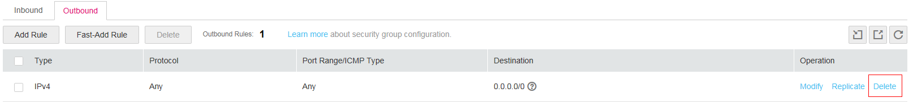
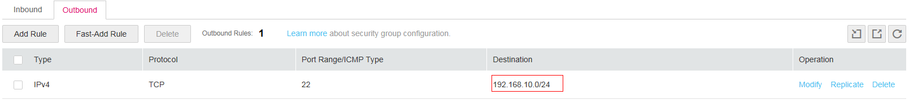

# Shared SNAT

The VPC service provides free, shared source network address translation \(SNAT\), which allows ECSs to use a limited number of public IP addresses to gain one-way access to the Internet for operations, such as updating software. However, Internet users cannot directly access the ECSs.

[Figure 1](#f04fc5d5739d142e5b38d73f3746f6cad) shows the working principle of shared SNAT. The Internet access traffic of ECSs is forwarded by the SNAT device to the Internet, and the response traffic from the Internet is forwarded to the ECSs also by the SNAT device. When forwarding ECS traffic to the Internet, the SNAT device converts the source IP addresses \(ECS private IP addresses\) in the data packets into the public IP addresses set on the SNAT device. When handing the response packets from the Internet to the ECSs, the SNAT device changes the public IP addresses in the response data packets to the private IP addresses of the ECSs.

**Figure  1**  SNAT function working principles

-   To enable shared SNAT using the API, set  **enable\_snat** to **true** by following the instructions provided in section **Neutron** \> **Routers** \> **Update router** in the _[Native OpenStack API Reference](https://docs.otc.t-systems.com/en-us/api/noa/en-us_topic_0057972979.html)_.
-   To enable shared SNAT on the management console:
    1.  Log in to the management console.
    2.  On the console homepage, under  **Network**, click **Virtual Private Cloud**.
    3.  On the  **Virtual Private Cloud** page, locate the VPC for which shared SNAT is to be enabled, and click **Modify**.
    4.  In the displayed dialog box, enable  **Shared SNAT**.
    5.  Click  **OK**.

After being configured for a VPC, shared SNAT takes effect for the whole VPC. If EIPs are bound to ECSs in a VPC for which shared SNAT is configured, Internet traffic is preferentially forwarded using the EIPs. If you want to prevent an ECS from connecting to the Internet, you can configure an outbound rule for the security group that contains the ECS.

For example:

To prevent an ECS from connecting to the Internet but allow the ECS to access the 192.168.10.0/24 network segment, configure the following rule for the security group containing the ECS:

1.  Delete the default outbound rule of the security group that allows all outgoing data packets.

    After this rule is deleted, ECSs in this security group are not allowed to access any network, including the internal networks in the VPC of the security group.

    **Figure  2**  Deleting the default outbound rule of the security group
    

2.  Add the required outbound rule.

    [Figure 3](#fig57288721181150) shows the added outbound rule that allows the ECS to access the 192.168.10.0/24 network segment.

    **Figure  3**  Adding an outbound rule for the security group
    

    The differences between shared SNAT and custom routes are as follows:

    Shared SNAT provides the SNAT function for a specified VPC through an API or the management console and enables all ECSs in the VPC to gain one-way access to the Internet. A custom route enables other ECSs to access the Internet through an SNAT server that has an EIP bound. The ECSs' access requests are routed to the SNAT server based on the route table. Shared SNAT takes effect for the whole VPC by default, while a custom route takes effect for the VPC or subnet for which routes have been configured. The priority of a custom route is higher than that of shared SNAT.

