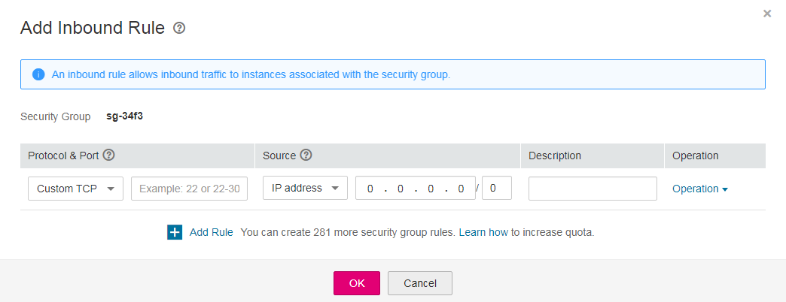
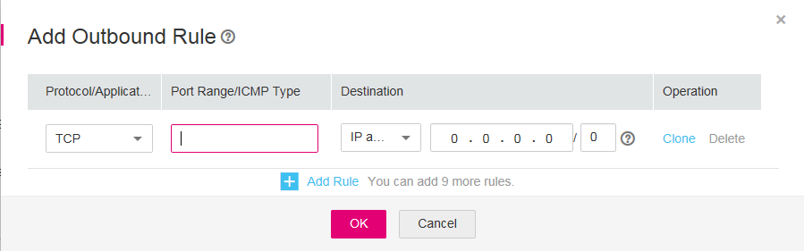

# Step 5: Add a Security Group Rule

## Scenarios

After a security group is created, you can add rules to the security group. A rule applies either to inbound traffic \(ingress\) or outbound traffic \(egress\). After ECSs are added to the security group, they are protected by the rules of that group.

-   Inbound rules control incoming traffic to ECSs associated with the security group.
-   Outbound rules control outgoing traffic from ECSs associated with the security group.

For details about the default security group rules, see  [Default Security Groups and Security Group Rules](default-security-groups-and-security-group-rules.md). For details about security group rule configuration examples, see  [Security Group Configuration Examples](security-group-configuration-examples.md).

## Procedure

1.  Log in to the management console.
2.  Click    in the upper left corner and select the desired region and project.
3.  On the console homepage, under  **Network**, click  **Virtual Private Cloud**.
4.  In the navigation pane on the left, choose  **Access Control**  \>  **Security Groups**.
5.  On the  **Security Groups**  page, locate the target security group and click  **Manage Rule**  in the  **Operation**  column to switch to the page for managing inbound and outbound rules.
6.  On the inbound rule tab, click  **Add Rule**. In the displayed dialog box, set required parameters to add an inbound rule.

    You can click  **+**  to add more inbound rules.

    **Figure  1**  Add Inbound Rule  
    

    **Table  1**  Inbound rule parameter description

    
    <table><thead align="left"><tr id="en-us_topic_0030969470_row1811565205613"><th class="cellrowborder" valign="top" width="12.55%" id="mcps1.2.4.1.1">
<strong id="en-us_topic_0030969470_b2131889160">Parameter</strong>

    </th>
    <th class="cellrowborder" valign="top" width="69.45%" id="mcps1.2.4.1.2">
<strong id="en-us_topic_0030969470_b2109380569">Description</strong>

    </th>
    <th class="cellrowborder" valign="top" width="18%" id="mcps1.2.4.1.3">
<strong id="en-us_topic_0030969470_b984193573219">Example Value</strong>

    </th>
    </tr>
    </thead>
    <tbody><tr id="en-us_topic_0030969470_row9115105219562"><td class="cellrowborder" rowspan="2" valign="top" width="12.55%" headers="mcps1.2.4.1.1 ">
Protocol &amp; Port

    

    </td>
    <td class="cellrowborder" valign="top" width="69.45%" headers="mcps1.2.4.1.2 ">
Specifies the network protocol. Currently, the value can be <strong id="en-us_topic_0030969470_b63642068">All</strong>, <strong id="en-us_topic_0030969470_b1275884042">TCP</strong>, <strong id="en-us_topic_0030969470_b873919964">UDP</strong>, <strong id="en-us_topic_0030969470_b1624173192">ICMP</strong>, <strong id="en-us_topic_0030969470_b104287139">GRE</strong>, or others.

    </td>
    <td class="cellrowborder" valign="top" width="18%" headers="mcps1.2.4.1.3 ">
Custom TCP

    </td>
    </tr>
    <tr id="en-us_topic_0030969470_row6510532121511"><td class="cellrowborder" valign="top" headers="mcps1.2.4.1.1 ">
<strong id="en-us_topic_0030969470_b840131483114">Port</strong>: specifies the port or port range over which the traffic can reach your ECS. Ports 1 to 65535 are all allowed. 

    </td>
    <td class="cellrowborder" valign="top" headers="mcps1.2.4.1.2 ">
22, or 22-30

    </td>
    </tr>
    <tr id="en-us_topic_0030969470_row511615528561"><td class="cellrowborder" valign="top" width="12.55%" headers="mcps1.2.4.1.1 ">
Source

    </td>
    <td class="cellrowborder" valign="top" width="69.45%" headers="mcps1.2.4.1.2 ">
<strong id="en-us_topic_0030969470_b18923132315592">Source</strong>: specifies the source of the security group rule. The value can be another security group or a single IP address. For example:

    <ul id="en-us_topic_0030969470_ul12116352195619"><li>xxx.xxx.xxx.xxx/32 (IPv4 address)</li><li>xxx.xxx.xxx.0/24 (subnet CIDR block)</li><li>0.0.0.0/0 (any IP address)</li></ul>
    </td>
    <td class="cellrowborder" valign="top" width="18%" headers="mcps1.2.4.1.3 ">
0.0.0.0/0

    </td>
    </tr>
    <tr id="en-us_topic_0030969470_row111615525565"><td class="cellrowborder" valign="top" width="12.55%" headers="mcps1.2.4.1.1 ">
Description

    </td>
    <td class="cellrowborder" valign="top" width="69.45%" headers="mcps1.2.4.1.2 ">
Provides supplementary information about the security group rule. This parameter is optional.

    
The security group rule description can contain a maximum of 255 characters and cannot contain angle brackets (&lt; or &gt;).

    </td>
    <td class="cellrowborder" valign="top" width="18%" headers="mcps1.2.4.1.3 ">
N/A

    </td>
    </tr>
    </tbody>
    </table>

7.  On the outbound rule tab, click  **Add Rule**. In the displayed dialog box, set required parameters to add an outbound rule.

    You can click  **+**  to add more outbound rules.

    **Figure  2**  Add Outbound Rule  
    

    **Table  2**  Outbound rule parameter description

    
    <table><thead align="left"><tr id="en-us_topic_0030969470_row19614623202312"><th class="cellrowborder" valign="top" width="12.55%" id="mcps1.2.4.1.1">
<strong id="en-us_topic_0030969470_b1246024759">Parameter</strong>

    </th>
    <th class="cellrowborder" valign="top" width="69.45%" id="mcps1.2.4.1.2">
<strong id="en-us_topic_0030969470_b392753994">Description</strong>

    </th>
    <th class="cellrowborder" valign="top" width="18%" id="mcps1.2.4.1.3">
<strong id="en-us_topic_0030969470_b78071625745">Example Value</strong>

    </th>
    </tr>
    </thead>
    <tbody><tr id="en-us_topic_0030969470_row76161523132311"><td class="cellrowborder" rowspan="2" valign="top" width="12.55%" headers="mcps1.2.4.1.1 ">
Protocol &amp; Port

    

    </td>
    <td class="cellrowborder" valign="top" width="69.45%" headers="mcps1.2.4.1.2 ">
Specifies the network protocol. Currently, the value can be <strong id="en-us_topic_0030969470_b202822549">All</strong>, <strong id="en-us_topic_0030969470_b2060632122">TCP</strong>, <strong id="en-us_topic_0030969470_b1478300017">UDP</strong>, <strong id="en-us_topic_0030969470_b1962364235">ICMP</strong>, <strong id="en-us_topic_0030969470_b722142174">GRE</strong>, or others.

    </td>
    <td class="cellrowborder" valign="top" width="18%" headers="mcps1.2.4.1.3 ">
Custom TCP

    </td>
    </tr>
    <tr id="en-us_topic_0030969470_row5616723112313"><td class="cellrowborder" valign="top" headers="mcps1.2.4.1.1 ">
<strong id="en-us_topic_0030969470_b1962587115">Port</strong>: specifies the port or port range over which the traffic can leave your ECS. The value ranges from 1 to 65535. 

    </td>
    <td class="cellrowborder" valign="top" headers="mcps1.2.4.1.2 ">
22, or 22-30

    </td>
    </tr>
    <tr id="en-us_topic_0030969470_row2617112315232"><td class="cellrowborder" valign="top" width="12.55%" headers="mcps1.2.4.1.1 ">
Source

    </td>
    <td class="cellrowborder" valign="top" width="69.45%" headers="mcps1.2.4.1.2 ">
<strong id="en-us_topic_0030969470_b4110206531">Source</strong>: specifies the source of the security group rule. The value can be another security group or a single IP address. For example:

    <ul id="en-us_topic_0030969470_ul16177237233"><li>xxx.xxx.xxx.xxx/32 (IPv4 address)</li><li>xxx.xxx.xxx.0/24 (subnet CIDR block)</li><li>0.0.0.0/0 (any IP address)</li></ul>
    </td>
    <td class="cellrowborder" valign="top" width="18%" headers="mcps1.2.4.1.3 ">
0.0.0.0/0

    </td>
    </tr>
    <tr id="en-us_topic_0030969470_row196181723162317"><td class="cellrowborder" valign="top" width="12.55%" headers="mcps1.2.4.1.1 ">
Description

    </td>
    <td class="cellrowborder" valign="top" width="69.45%" headers="mcps1.2.4.1.2 ">
Provides supplementary information about the security group rule. This parameter is optional.

    
The security group rule description can contain a maximum of 255 characters and cannot contain angle brackets (&lt; or &gt;).

    </td>
    <td class="cellrowborder" valign="top" width="18%" headers="mcps1.2.4.1.3 ">
N/A

    </td>
    </tr>
    </tbody>
    </table>

8.  Click  **OK**.

