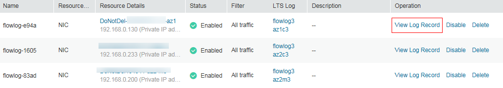

# Viewing a VPC Flow Log<a name="FlowLog_0004"></a>

## Scenarios<a name="section15598193716333"></a>

View information about your flow log record.

The capture window is approximately 10 minutes, which indicates that a flow log record will be generated every 10 minutes. After creating a VPC flow log, you need to wait about 10 minutes before you can view the flow log record.

> **NOTE:**   
>If an ECS is in the stopped state, flow log records are not displayed.  

## Procedure<a name="section7359352124511"></a>

1.  Log in to the management console.
2.  Click    in the upper left corner and select the desired region and project.
3.  On the console homepage, under  **Network**, click  **Virtual Private Cloud**.
4.  In the navigation pane on the left, choose  **VPC Flow Logs**.
5.  Locate the target VPC flow log and click  **View Log Record**  in the  **Operation**  column to view information about the flow log record in LTS.

    **Figure  1**  Viewing a log record<a name="fig3110112519524"></a>  
    

    **Figure  2**  Flow log record<a name="fig184421854195912"></a>  
    

    The flow log record is in the following format:

    ```
    <version> <project-id> <interface-id> <srcaddr> <dstaddr> <srcport> <dstport> <protocol> <packets> <bytes> <start> <end> <action> <log-status>
    ```

    Example 1: The following is an example of a flow log record in which data was recorded during the capture window:

    ```
    1 5f67944957444bd6bb4fe3b367de8f3d 1d515d18-1b36-47dc-a983-bd6512aed4bd 192.168.0.154 192.168.3.25 38929 53 17 1 96 1548752136 1548752736 ACCEPT OK
    ```

    Value  **1**  indicates the VPC flow log version. Traffic with a size of 96 bytes to NIC  **1d515d18-1b36-47dc-a983-bd6512aed4bd**  during the past 10 minutes \(from 16:55:36 to 17:05:36 on January 29, 2019\) was allowed. A data packet was transmitted over the UDP protocol from source IP address  **192.168.0.154**  and port  **38929**  to destination IP address  **192.168.3.25**  and port  **53**.

    Example 2: The following is an example of a flow log record in which no data was recorded during the capture window:

    ```
    1 5f67944957444bd6bb4fe3b367de8f3d 1d515d18-1b36-47dc-a983-bd6512aed4bd - - - - - - - 1431280876 1431280934 - NODATA
    ```

    Example 3: The following is an example of a flow log record in which data was skipped during the capture window:

    ```
    1 5f67944957444bd6bb4fe3b367de8f3d 1d515d18-1b36-47dc-a983-bd6512aed4bd - - - - - - - 1431280876 1431280934 - SKIPDATA
    ```

    [Table 1](#table1313851722313)  describes the fields of a flow log record.

    **Table  1**  Log field description

    <a name="table1313851722313"></a>
    <table><thead align="left"><tr id="row813819178239"><th class="cellrowborder" valign="top" width="21.25%" id="mcps1.2.4.1.1"><p id="p4138151722319"><a name="p4138151722319"></a><a name="p4138151722319"></a><strong id="b42231630175912"><a name="b42231630175912"></a><a name="b42231630175912"></a>Field</strong></p>
    </th>
    <th class="cellrowborder" valign="top" width="38.29%" id="mcps1.2.4.1.2"><p id="p313821712314"><a name="p313821712314"></a><a name="p313821712314"></a><strong id="b2356133145912"><a name="b2356133145912"></a><a name="b2356133145912"></a>Description</strong></p>
    </th>
    <th class="cellrowborder" valign="top" width="40.46%" id="mcps1.2.4.1.3"><p id="p181381117112313"><a name="p181381117112313"></a><a name="p181381117112313"></a><strong id="b84235270685752"><a name="b84235270685752"></a><a name="b84235270685752"></a>Example Value</strong></p>
    </th>
    </tr>
    </thead>
    <tbody><tr id="row513861742316"><td class="cellrowborder" valign="top" width="21.25%" headers="mcps1.2.4.1.1 "><p id="p171381817152313"><a name="p171381817152313"></a><a name="p171381817152313"></a>version</p>
    </td>
    <td class="cellrowborder" valign="top" width="38.29%" headers="mcps1.2.4.1.2 "><p id="p181381017102311"><a name="p181381017102311"></a><a name="p181381017102311"></a>Specifies the VPC flow log version.</p>
    </td>
    <td class="cellrowborder" valign="top" width="40.46%" headers="mcps1.2.4.1.3 "><p id="p181383178234"><a name="p181383178234"></a><a name="p181383178234"></a>1</p>
    </td>
    </tr>
    <tr id="row1013818170231"><td class="cellrowborder" valign="top" width="21.25%" headers="mcps1.2.4.1.1 "><p id="p813814175238"><a name="p813814175238"></a><a name="p813814175238"></a>project-id</p>
    </td>
    <td class="cellrowborder" valign="top" width="38.29%" headers="mcps1.2.4.1.2 "><p id="p14138171752312"><a name="p14138171752312"></a><a name="p14138171752312"></a>Specifies the project ID.</p>
    </td>
    <td class="cellrowborder" valign="top" width="40.46%" headers="mcps1.2.4.1.3 "><p id="p41383177232"><a name="p41383177232"></a><a name="p41383177232"></a>5f67944957444bd6bb4fe3b367de8f3d</p>
    </td>
    </tr>
    <tr id="row51388179233"><td class="cellrowborder" valign="top" width="21.25%" headers="mcps1.2.4.1.1 "><p id="p1138517132311"><a name="p1138517132311"></a><a name="p1138517132311"></a>interface-id</p>
    </td>
    <td class="cellrowborder" valign="top" width="38.29%" headers="mcps1.2.4.1.2 "><p id="p10138121792314"><a name="p10138121792314"></a><a name="p10138121792314"></a>Specifies the ID of the NIC for which the traffic is recorded.</p>
    </td>
    <td class="cellrowborder" valign="top" width="40.46%" headers="mcps1.2.4.1.3 "><p id="p13138131762311"><a name="p13138131762311"></a><a name="p13138131762311"></a>1d515d18-1b36-47dc-a983-bd6512aed4bd</p>
    </td>
    </tr>
    <tr id="row91381417172313"><td class="cellrowborder" valign="top" width="21.25%" headers="mcps1.2.4.1.1 "><p id="p313851792312"><a name="p313851792312"></a><a name="p313851792312"></a>srcaddr</p>
    </td>
    <td class="cellrowborder" valign="top" width="38.29%" headers="mcps1.2.4.1.2 "><p id="p17138151742312"><a name="p17138151742312"></a><a name="p17138151742312"></a>Specifies the source IP address.</p>
    </td>
    <td class="cellrowborder" valign="top" width="40.46%" headers="mcps1.2.4.1.3 "><p id="p913821715234"><a name="p913821715234"></a><a name="p913821715234"></a>192.168.0.154</p>
    </td>
    </tr>
    <tr id="row4138817182313"><td class="cellrowborder" valign="top" width="21.25%" headers="mcps1.2.4.1.1 "><p id="p15138717162315"><a name="p15138717162315"></a><a name="p15138717162315"></a>dstaddr</p>
    </td>
    <td class="cellrowborder" valign="top" width="38.29%" headers="mcps1.2.4.1.2 "><p id="p1313821714235"><a name="p1313821714235"></a><a name="p1313821714235"></a>Specifies the destination IP address.</p>
    </td>
    <td class="cellrowborder" valign="top" width="40.46%" headers="mcps1.2.4.1.3 "><p id="p181381017162318"><a name="p181381017162318"></a><a name="p181381017162318"></a>192.168.3.25</p>
    </td>
    </tr>
    <tr id="row11381917152316"><td class="cellrowborder" valign="top" width="21.25%" headers="mcps1.2.4.1.1 "><p id="p1513815171239"><a name="p1513815171239"></a><a name="p1513815171239"></a>srcport</p>
    </td>
    <td class="cellrowborder" valign="top" width="38.29%" headers="mcps1.2.4.1.2 "><p id="p3138101712237"><a name="p3138101712237"></a><a name="p3138101712237"></a>Specifies the source port of the traffic.</p>
    </td>
    <td class="cellrowborder" valign="top" width="40.46%" headers="mcps1.2.4.1.3 "><p id="p31381817152318"><a name="p31381817152318"></a><a name="p31381817152318"></a>38929</p>
    </td>
    </tr>
    <tr id="row2013819179235"><td class="cellrowborder" valign="top" width="21.25%" headers="mcps1.2.4.1.1 "><p id="p10138217122314"><a name="p10138217122314"></a><a name="p10138217122314"></a>dstport</p>
    </td>
    <td class="cellrowborder" valign="top" width="38.29%" headers="mcps1.2.4.1.2 "><p id="p17138131762314"><a name="p17138131762314"></a><a name="p17138131762314"></a>Specifies the destination port of the traffic.</p>
    </td>
    <td class="cellrowborder" valign="top" width="40.46%" headers="mcps1.2.4.1.3 "><p id="p121381317162319"><a name="p121381317162319"></a><a name="p121381317162319"></a>53</p>
    </td>
    </tr>
    <tr id="row121381117112313"><td class="cellrowborder" valign="top" width="21.25%" headers="mcps1.2.4.1.1 "><p id="p1213861710233"><a name="p1213861710233"></a><a name="p1213861710233"></a>protocol</p>
    </td>
    <td class="cellrowborder" valign="top" width="38.29%" headers="mcps1.2.4.1.2 "><p id="p1513831742314"><a name="p1513831742314"></a><a name="p1513831742314"></a>Specifies the Internet Assigned Numbers Authority (IANA) protocol number of the traffic. For details, see <a href="http://www.iana.org/assignments/protocol-numbers/protocol-numbers.xhtml" target="_blank" rel="noopener noreferrer">Assigned Internet Protocol Numbers</a>.</p>
    </td>
    <td class="cellrowborder" valign="top" width="40.46%" headers="mcps1.2.4.1.3 "><p id="p3138171792310"><a name="p3138171792310"></a><a name="p3138171792310"></a>17</p>
    </td>
    </tr>
    <tr id="row2138171719237"><td class="cellrowborder" valign="top" width="21.25%" headers="mcps1.2.4.1.1 "><p id="p113801772317"><a name="p113801772317"></a><a name="p113801772317"></a>packets</p>
    </td>
    <td class="cellrowborder" valign="top" width="38.29%" headers="mcps1.2.4.1.2 "><p id="p9138171710235"><a name="p9138171710235"></a><a name="p9138171710235"></a>Specifies the number of packets transferred during the capture window.</p>
    </td>
    <td class="cellrowborder" valign="top" width="40.46%" headers="mcps1.2.4.1.3 "><p id="p6138171720239"><a name="p6138171720239"></a><a name="p6138171720239"></a>1</p>
    </td>
    </tr>
    <tr id="row313811178234"><td class="cellrowborder" valign="top" width="21.25%" headers="mcps1.2.4.1.1 "><p id="p171381517112312"><a name="p171381517112312"></a><a name="p171381517112312"></a>bytes</p>
    </td>
    <td class="cellrowborder" valign="top" width="38.29%" headers="mcps1.2.4.1.2 "><p id="p813861716230"><a name="p813861716230"></a><a name="p813861716230"></a>Specifies the number of bytes transferred during the capture window.</p>
    </td>
    <td class="cellrowborder" valign="top" width="40.46%" headers="mcps1.2.4.1.3 "><p id="p6138121792314"><a name="p6138121792314"></a><a name="p6138121792314"></a>96</p>
    </td>
    </tr>
    <tr id="row11384176232"><td class="cellrowborder" valign="top" width="21.25%" headers="mcps1.2.4.1.1 "><p id="p71380173233"><a name="p71380173233"></a><a name="p71380173233"></a>start</p>
    </td>
    <td class="cellrowborder" valign="top" width="38.29%" headers="mcps1.2.4.1.2 "><p id="p513841762316"><a name="p513841762316"></a><a name="p513841762316"></a>Specifies the time, in Unix seconds, of the start of the capture window.</p>
    </td>
    <td class="cellrowborder" valign="top" width="40.46%" headers="mcps1.2.4.1.3 "><p id="p61381178236"><a name="p61381178236"></a><a name="p61381178236"></a>1548752136</p>
    </td>
    </tr>
    <tr id="row17138121720239"><td class="cellrowborder" valign="top" width="21.25%" headers="mcps1.2.4.1.1 "><p id="p1313819174239"><a name="p1313819174239"></a><a name="p1313819174239"></a>end</p>
    </td>
    <td class="cellrowborder" valign="top" width="38.29%" headers="mcps1.2.4.1.2 "><p id="p11138017112317"><a name="p11138017112317"></a><a name="p11138017112317"></a>Specifies the time, in Unix seconds, of the end of the capture window.</p>
    </td>
    <td class="cellrowborder" valign="top" width="40.46%" headers="mcps1.2.4.1.3 "><p id="p1313821782316"><a name="p1313821782316"></a><a name="p1313821782316"></a>1548752736</p>
    </td>
    </tr>
    <tr id="row11383177238"><td class="cellrowborder" valign="top" width="21.25%" headers="mcps1.2.4.1.1 "><p id="p1138517132310"><a name="p1138517132310"></a><a name="p1138517132310"></a>action</p>
    </td>
    <td class="cellrowborder" valign="top" width="38.29%" headers="mcps1.2.4.1.2 "><p id="p19138171732318"><a name="p19138171732318"></a><a name="p19138171732318"></a>Specifies the action associated with the traffic:</p>
    <a name="ul151381717152318"></a><a name="ul151381717152318"></a><ul id="ul151381717152318"><li><strong id="b460717481811"><a name="b460717481811"></a><a name="b460717481811"></a>ACCEPT</strong>: The recorded traffic was permitted by the security groups or firewalls.</li><li><strong id="b1359018516219"><a name="b1359018516219"></a><a name="b1359018516219"></a>REJECT</strong>: The recorded traffic was not permitted by the firewalls.</li></ul>
    </td>
    <td class="cellrowborder" valign="top" width="40.46%" headers="mcps1.2.4.1.3 "><p id="p8138617162312"><a name="p8138617162312"></a><a name="p8138617162312"></a>ACCEPT</p>
    </td>
    </tr>
    <tr id="row1713820178232"><td class="cellrowborder" valign="top" width="21.25%" headers="mcps1.2.4.1.1 "><p id="p91383171236"><a name="p91383171236"></a><a name="p91383171236"></a>log-status</p>
    </td>
    <td class="cellrowborder" valign="top" width="38.29%" headers="mcps1.2.4.1.2 "><p id="p1713861762314"><a name="p1713861762314"></a><a name="p1713861762314"></a>Specifies the logging status of the VPC flow log:</p>
    <a name="ul21381617122319"></a><a name="ul21381617122319"></a><ul id="ul21381617122319"><li><strong id="b54661210129"><a name="b54661210129"></a><a name="b54661210129"></a>OK</strong>: Data is logging normally to the chosen destinations.</li><li><strong>NODATA</strong>: There was no traffic of the <strong id="b84235270616738"><a name="b84235270616738"></a><a name="b84235270616738"></a>Filter</strong> setting to or from the NIC during the capture window.</li><li><strong id="b44741312212"><a name="b44741312212"></a><a name="b44741312212"></a>SKIPDATA</strong>: Some flow log records were skipped during the capture window. This may be caused by an internal capacity constraint or an internal error.</li></ul>
    <p id="p192827623912"><a name="p192827623912"></a><a name="p192827623912"></a>Example:</p>
    <p id="p18825610113911"><a name="p18825610113911"></a><a name="p18825610113911"></a>When <strong id="b84235270616831"><a name="b84235270616831"></a><a name="b84235270616831"></a>Filter</strong> is set to <strong id="b84235270616850"><a name="b84235270616850"></a><a name="b84235270616850"></a>Accepted traffic</strong>, if there is accepted traffic, the value of <strong id="b842352706161659"><a name="b842352706161659"></a><a name="b842352706161659"></a>log-status</strong> is <strong id="b84235270616174"><a name="b84235270616174"></a><a name="b84235270616174"></a>OK</strong>. If there is no accepted traffic, the value of <strong id="b842352706161743"><a name="b842352706161743"></a><a name="b842352706161743"></a>log-status</strong> is <strong id="b842352706161747"><a name="b842352706161747"></a><a name="b842352706161747"></a>NODATA</strong> regardless of whether there is rejected traffic. If some accepted traffic is abnormally skipped, the value of <strong id="b518035696162046"><a name="b518035696162046"></a><a name="b518035696162046"></a>log-status</strong> is <strong id="b842352706162055"><a name="b842352706162055"></a><a name="b842352706162055"></a>SKIPDATA</strong>.</p>
    </td>
    <td class="cellrowborder" valign="top" width="40.46%" headers="mcps1.2.4.1.3 "><p id="p161381417142314"><a name="p161381417142314"></a><a name="p161381417142314"></a>OK</p>
    </td>
    </tr>
    </tbody>
    </table>


You can enter a keyword on the log topic details page on the LTS console to search for flow log records.

