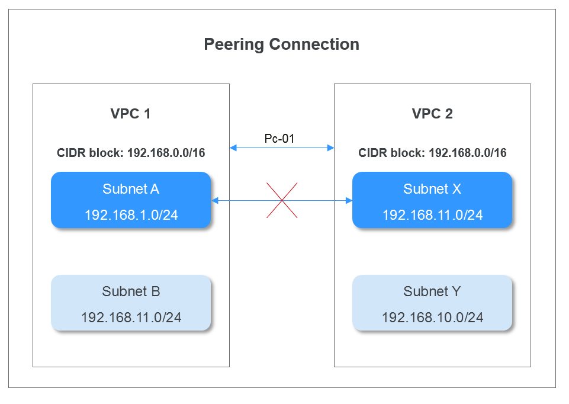

# VPC Peering Connection Configuration Plans

To enable two VPCs to communicate with each other, you can create a VPC peering connection between them. As long as the two VPCs do not overlap, you can configure routes that point to entire VPCs for the VPC peering connection. If the two VPCs have overlapping CIDR blocks, you can only configure routes that point to specific subnets of the VPCs for the VPC peering connection.

-   Configurations with Routes to Entire VPCs
    -   There can be two or more VPCs peered together using VPC peering connections.
    -   Regardless of how many VPCs are connected, if you need to configure routes that point to entire VPCs in a VPC peering connection, none of the VPCs involved in the connection can have overlapping CIDR blocks. Otherwise, the VPC peering connection will be unable to take effect because the routes will be unreachable.
    -   The destination of the route that points to an entire VPC is the CIDR block of the peer VPC, and the next hop is the VPC peering connection ID.

-   Configurations with Routes to Specific Subnets

    If VPCs connected by a VPC peering connection have overlapping CIDR blocks, the peering connection can only enable communication between specific \(non-overlapping\) subnets in the VPCs. If the subnets in the VPCs of a VPC peering connection have overlapping CIDR blocks, the peering connection will not take effect. When creating a VPC peering connection, ensure that the VPCs involved do not contain overlapping subnets.

    For example, VPC 1 and VPC 2 have matching CIDR blocks, but the subnets in the two VPCs do not overlap. A VPC peering connection can be created between pairs of subnets that do not overlap with each other. The route table is used to control the specific subnets that the VPC peering connection is created for.  [Figure 1](#fig95191521148)  shows a VPC peering connection created between two subnets. Routes are required to enable communication between Subnet A in VPC 1 and Subnet X in VPC 2 in the figure.

    **Figure  1**  VPC peering connection between Subnet A and Subnet X  
    

    [Figure 2](#fig13211186151514)  shows the routes configured for the VPC peering connection between Subnet A and Subnet X. After the routes are configured, Subnet A and Subnet X can communicate with each other.

    **Figure  2**  Route table for the VPC peering connection between Subnet A and Subnet X  
    

    If two VPCs have overlapping subnets, the VPC peering connection created between the two subnets does not take effect, and the subnets cannot communicate with each other.

    As shown in  [Figure 3](#fig1253173812157), Subnet B and Subnet X have matching CIDR blocks. Therefore, subnet A preferentially accesses subnet B that is in its same VPC and a VPC peering connection cannot be created between Subnet A and Subnet X.

    **Figure  3**  Invalid VPC peering connection  
    

    If peering connections are used to link VPC 1 to multiple VPCs, for example, VPC 2, VPC 3, and VPC 4, the subnet CIDR blocks of VPC 1 cannot overlap with those of VPC 2, VPC 3, and VPC 4. If VPC 2, VPC 3, and VPC 4 have overlapping subnets, a VPC peering connection can be created between only one of these overlapping subnets and a subnet of VPC 1. If a VPC peering connection is created between a subnet and the other  _N_  subnets, none of the subnets can have overlapping CIDR blocks.

