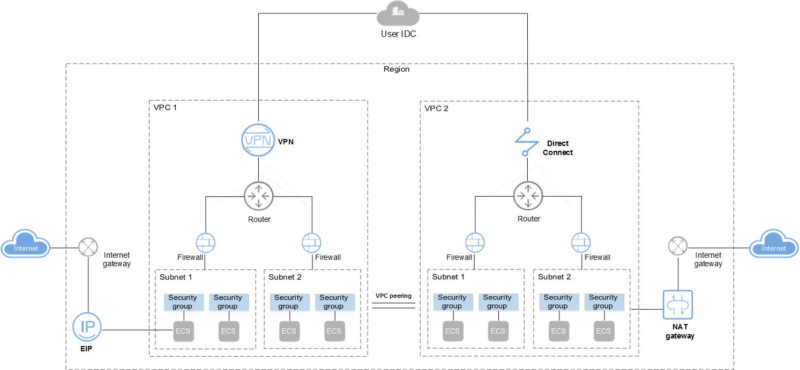

# What Is Virtual Private Cloud?

## Overview

The Virtual Private Cloud \(VPC\) service enables you to provision logically isolated, configurable, and manageable virtual networks for Elastic Cloud Servers \(ECSs\), improving cloud service security and simplifying network deployment.

You can create security groups and VPNs, configure IP address ranges, and specify bandwidth sizes in your VPC. With a VPC, you can configure and manage the networks within the VPC, making changes to these networks as needed, quickly and securely. You can also define rules for communication between ECSs in the same security group or in different security groups.

**Figure  1**  VPC components  

## Advantages

-   Flexible configuration

    You can create VPCs, add subnets, specify IP address ranges, and configure route tables. You can configure the same VPC for ECSs that are in different availability zones \(AZs\).

-   Secure and reliable

    Each VPC is completely logically isolated from other VPCs using the tunneling technology. By default, different VPCs cannot communicate with each other. Firewalls are provided to protect subnets, and security groups are provided to protect ECSs. The firewalls and security groups add additional layers of security to your VPC, making your network very secure.

-   Interconnectivity

    By default, instances in a VPC cannot access the Internet. You can leverage elastic IP addresses \(EIPs\), Elastic Load Balancing \(ELB\) functions, NAT gateways, Virtual Private Network \(VPN\) connections, and Direct Connect connections to enable access to or from the Internet.

    By default, instances in two VPCs cannot communicate with each other. You can create a VPC peering connection to enable the instances in the two VPCs to communicate with each other using private IP addresses.

    Multiple connectivity options are provided to meet enterprises' diverse service requirements for the cloud, to allow you to deploy enterprise applications with ease, and to lower enterprise IT operation and maintenance \(O&M\) costs.

-   High-speed access

    Dynamic Border Gateway Protocol \(BGP\) is used to provide access to various carrier networks. For example, up to 21 dynamic BGP connections are established to multiple carriers. The dynamic BGP connections enable real-time failover based on the preset routing protocols, ensuring high network stability, low network latency, and smooth access to services on the cloud.

## Accessing the VPC

You can access the VPC service through the management console or using HTTPS-based APIs.

-   Management console

    You can use the console to perform operations on VPC resources directly. To access the VPC service, log in to the management console and select  **Virtual Private Cloud**  from the console homepage.

-   API

    If you need to integrate the VPC service provided by the cloud system into a third-party system for secondary development, you can use an API to access the VPC service. For details, see the  _Virtual Private Cloud API Reference_.

