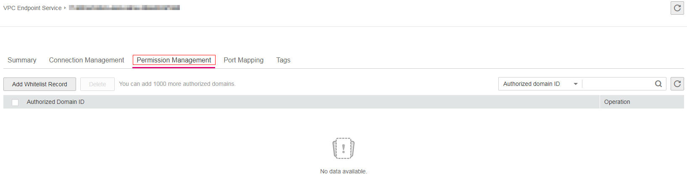

# Managing Permissions

## Scenarios

Connection management controls the access of a VPC endpoint in one account to a VPC endpoint service in another account.

After a VPC endpoint service is created, you can add an authorized account ID to or delete it from the whitelist of the endpoint service.

The whitelist is only checked on creation of a VPC endpoint. Please pay attention to the following items:

-   If the whitelist is empty, creation of a VPC endpoint in another account is not supported.
-   If an account ID is already in the whitelist of the VPC endpoint service, you can use this account to create a VPC endpoint for connecting to the VPC endpoint service.
-   If an account ID is not in the whitelist of the VPC endpoint service, you cannot use this account to create a VPC endpoint for connecting to the VPC endpoint service.

## Procedure

1.  Log in to the management console.
2.  Click    in the upper left corner and select the desired region and project.

1.  Click  **Service List**  and choose  **VPC Endpoint**  under  **Network**.

1.  In the navigation pane on the left, choose  **VPC Endpoint**  \>  **VPC Endpoint Services**.
2.  In the VPC endpoint service list, locate the target VPC endpoint service and click its name.
3.  Click the  **Permission Management**  tab.

    **Figure  1**  Permission Management  
    

4.  On the displayed page, click  **Add to Whitelist**.

    **Figure  2**  Add to Whitelist  
    

5.  Enter an authorized domain ID in the required format and click  **OK**.

    > **NOTE:** 
    >-   Your domain is in the whitelist of your own VPC endpoint service by default.
    >-   The authorized domain ID is in the  **iam:domain::domain\_id**  format, for example,  **iam:domain::1564ec50ef2a47c791ea5536353ed4b9**
    >-   Adding  **\***  to the whitelist means that all users can access the VPC endpoint service.

6.  Delete one or more whitelist records.
    -   To delete a single whitelist record, locate the target authorized domain ID and click  **Delete**  in the  **Operation**  column.
    -   To delete multiple whitelist records, select the authorized domain IDs to be deleted and click  **Delete**  in the upper part.

