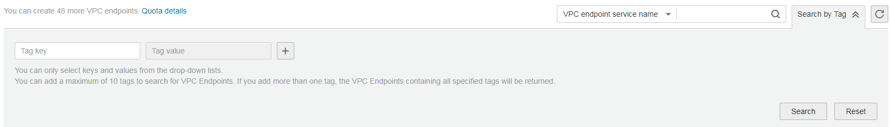
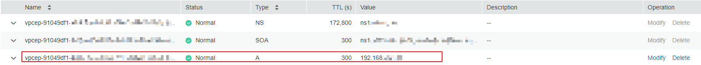

# Querying and Accessing a VPC Endpoint

## Scenarios

After a VPC endpoint is created, you can query its details and access it.

## Query a VPC Endpoint

Perform the following operations to query details of a VPC endpoint, including the ID, associated VPC endpoint service name, VPC, and status.

1.  Log in to the management console.
2.  Click    in the upper left corner and select the desired region and project.

1.  Click  **Service List**  and choose  **VPC Endpoint**  under  **Network**.

    On the displayed page, locate the target VPC endpoint by entering a filter in the search box in the upper right corner:

    -   Search by VPC endpoint service name or VPC endpoint ID as follows:
        1.  Select  **VPC endpoint service name**  or  **ID**  in the filter box.
        2.  Enter a keyword in the search box.
        3.  Click    to start the search.

            VPC endpoints containing the keyword are displayed in the list.

    -   Search for a VPC endpoint by the preset tag:
        1.  Click    in  **Search by Tag**  to expand the tag search area.

            **Figure  1**  Tag search area  
            

        2.  Enter a tag and a value.

            Enter a key or value or select a key or value from the drop-down list.

            You can add a maximum of 10 tags to search for VPC endpoints.

        3.  Click  **Search**.

            VPC endpoints containing the specified tag are displayed in the list.

            If you set multiple pairs of tags, VPC endpoints containing all the specified tags are displayed.

2.  In the VPC endpoint list, locate the target endpoint and click its ID.

    After an interface VPC endpoint is created, a private IP address and a private domain name are generated if you select  **Create a Private Domain Name**  during creation.

    **Figure  2**  Summary of the VPC endpoint  
    

    Details of a VPC endpoint include summary and tags.

    **Table  1**  Parameter description

    
    <table><thead align="left"><tr id="row123731829185916"><th class="cellrowborder" valign="top" width="21.09%" id="mcps1.2.4.1.1">
<strong id="b3366113318010">Tab</strong>

    </th>
    <th class="cellrowborder" valign="top" width="29.849999999999998%" id="mcps1.2.4.1.2">
<strong id="b1589733417">Parameter</strong>

    </th>
    <th class="cellrowborder" valign="top" width="49.059999999999995%" id="mcps1.2.4.1.3">
<strong id="b778155451616">Description</strong>

    </th>
    </tr>
    </thead>
    <tbody><tr id="row6601518175912"><td class="cellrowborder" rowspan="8" valign="top" width="21.09%" headers="mcps1.2.4.1.1 ">
Summary

    </td>
    <td class="cellrowborder" valign="top" width="29.849999999999998%" headers="mcps1.2.4.1.2 ">
ID

    </td>
    <td class="cellrowborder" valign="top" width="49.059999999999995%" headers="mcps1.2.4.1.3 ">
Specifies the ID of the VPC endpoint.

    </td>
    </tr>
    <tr id="row6602718105914"><td class="cellrowborder" valign="top" headers="mcps1.2.4.1.1 ">
VPC

    </td>
    <td class="cellrowborder" valign="top" headers="mcps1.2.4.1.2 ">
Specifies the region where the VPC endpoint is deployed.

    </td>
    </tr>
    <tr id="row1660320181596"><td class="cellrowborder" valign="top" headers="mcps1.2.4.1.1 ">
VPC Endpoint Service Name

    </td>
    <td class="cellrowborder" valign="top" headers="mcps1.2.4.1.2 ">
Specifies the name of the VPC endpoint service that is associated with the VPC endpoint.

    </td>
    </tr>
    <tr id="row1260311185593"><td class="cellrowborder" valign="top" headers="mcps1.2.4.1.1 ">
Private IP Address

    </td>
    <td class="cellrowborder" valign="top" headers="mcps1.2.4.1.2 ">
Specifies the IP address for accessing the VPC endpoint.

    </td>
    </tr>
    <tr id="row1603161817598"><td class="cellrowborder" valign="top" headers="mcps1.2.4.1.1 ">
Private Domain Name

    </td>
    <td class="cellrowborder" valign="top" headers="mcps1.2.4.1.2 ">
Specifies the private domain name for accessing the VPC endpoint.

    </td>
    </tr>
    <tr id="row9659329903"><td class="cellrowborder" valign="top" headers="mcps1.2.4.1.1 ">
Status

    </td>
    <td class="cellrowborder" valign="top" headers="mcps1.2.4.1.2 ">
Specifies the status of the VPC endpoint.

    </td>
    </tr>
    <tr id="row1465962910011"><td class="cellrowborder" valign="top" headers="mcps1.2.4.1.1 ">
Type

    </td>
    <td class="cellrowborder" valign="top" headers="mcps1.2.4.1.2 ">
Specifies the type of the VPC endpoint service that is associated with the VPC endpoint.

    </td>
    </tr>
    <tr id="row1865942911010"><td class="cellrowborder" valign="top" headers="mcps1.2.4.1.1 ">
Created

    </td>
    <td class="cellrowborder" valign="top" headers="mcps1.2.4.1.2 ">
Specifies the creation time of the VPC endpoint.

    </td>
    </tr>
    <tr id="row1262811653513"><td class="cellrowborder" rowspan="3" valign="top" width="21.09%" headers="mcps1.2.4.1.1 ">
Tags

    </td>
    <td class="cellrowborder" valign="top" width="29.849999999999998%" headers="mcps1.2.4.1.2 ">
Key

    </td>
    <td class="cellrowborder" valign="top" width="49.059999999999995%" headers="mcps1.2.4.1.3 ">
Specifies the tag key of the VPC endpoint.

    </td>
    </tr>
    <tr id="row1468217176366"><td class="cellrowborder" valign="top" headers="mcps1.2.4.1.1 ">
Value

    </td>
    <td class="cellrowborder" valign="top" headers="mcps1.2.4.1.2 ">
Specifies the tag value of the VPC endpoint.

    </td>
    </tr>
    <tr id="row1791516293369"><td class="cellrowborder" valign="top" headers="mcps1.2.4.1.1 ">
Operation

    </td>
    <td class="cellrowborder" valign="top" headers="mcps1.2.4.1.2 ">
Specifies the operation on the VPC endpoint tag, for example, you can select <strong id="b128731044142611">Edit</strong> or <strong id="b1287404412616">Delete</strong>.

    </td>
    </tr>
    </tbody>
    </table>

## Access a VPC Endpoint \(using a private IP address\)

Perform the following operations to access a VPC endpoint using its private IP address:

1.  In the VPC that the VPC endpoint belongs to, log in to the backend resource, for example, an ECS.
2.  Select a command based on the backend resource type and run the command to access the VPC endpoint. The command format is as follows:

    _Command_ _Private IP address_:_Port number_

    The following is a command example:

    **curl **_Private IP address:Port number_

## Access a VPC Endpoint \(using a private domain name\)

You can access a VPC endpoint using its private domain name if you select  **Create a Private Domain Name**  when creating the endpoint.

The system automatically creates a private zone for the generated domain name and adds A record set for the private zone to resolve the domain name into the private IP address of the VPC endpoint.

You can view the corresponding private zone and its resolution records on the DNS console. For more information, see  [Configuring a Private Zone](https://docs.otc.t-systems.com/en-us/usermanual/dns/dns_qs_0006.html).

**Viewing the record set of the private domain name**

1.  Log in to the management console.
2.  In the  **Network**  category, click  **Domain Name Service**.

    The DNS console is displayed.

3.  In the navigation pane, choose  **Private Zones**.

    The  **Private Zones**  page is displayed.

1.  In the private zone list, click the name of the target private zone.

    The record set page is displayed.

2.  In the record set list, locate the target A record set and view its information.

    When the value in the  **Status**  column becomes  **Normal**, the resolution takes effect.

    **Figure  3**  Record set of the private domain name  
    

**Accessing a VPC endpoint using a private domain name**

1.  In the VPC that the VPC endpoint belongs to, log in to the backend resource, for example, an ECS.
2.  Select a command based on the backend resource type and run the command to access the VPC endpoint. The command format is as follows:

    _Command_ _Private domain name_:_Port number_

    The following is a command example:

    **curl **_Private domain name:Port number_

