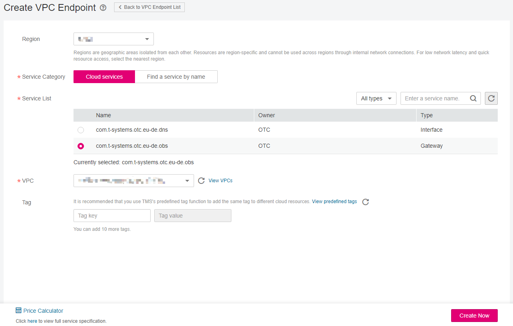
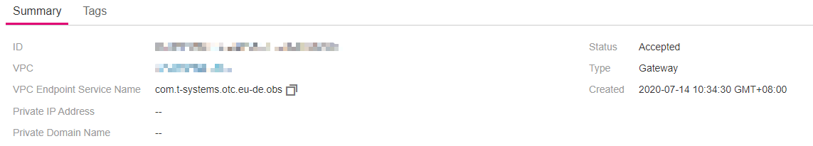

# Step 2: Create a VPC Endpoint for Connecting to OBS

## Scenarios

This section describes how to create a VPC endpoint to access OBS from your local data center.

## Procedure

1.  On the displayed page, click  **Create VPC Endpoint**.

    The  **Create VPC Endpoint**  page is displayed.

    **Figure  1**  Create VPC Endpoint  
    

2.  Configure parameters by referring to  [Table 1](#table15408172022211).

    **Table  1**  Required parameters

    
    <table><thead align="left"><tr id="row1740572010223"><th class="cellrowborder" valign="top" width="22.830000000000002%" id="mcps1.2.3.1.1">
<strong id="b79018283246">Parameter</strong>

    </th>
    <th class="cellrowborder" valign="top" width="77.17%" id="mcps1.2.3.1.2">
<strong id="b89611528142420">Description</strong>

    </th>
    </tr>
    </thead>
    <tbody><tr id="row54061020172210"><td class="cellrowborder" valign="top" width="22.830000000000002%" headers="mcps1.2.3.1.1 ">
Region

    </td>
    <td class="cellrowborder" valign="top" width="77.17%" headers="mcps1.2.3.1.2 ">
Specifies the region where the VPC endpoint is located.

    
Resources in different regions cannot communicate with each other over internal networks. For lower network latency and faster access to resources, select the nearest region.

    </td>
    </tr>
    <tr id="row440662082215"><td class="cellrowborder" valign="top" width="22.830000000000002%" headers="mcps1.2.3.1.1 ">
Service Category

    </td>
    <td class="cellrowborder" valign="top" width="77.17%" headers="mcps1.2.3.1.2 ">
There are two options: <strong id="b4151954711">Cloud services</strong> or <strong id="b61611918472">Find a service by name</strong>.

    <ul id="ul033017631615"><li><strong id="b632519311142">Cloud services</strong>: Select this value if the target VPC endpoint service is a cloud service.</li><li><strong id="b191701133201418">Find a service by name</strong>: Select this value if the target VPC endpoint service is a private service of your own.</li></ul>
    
Example: <strong id="b2041324724719">Cloud services</strong>

    </td>
    </tr>
    <tr id="row5406820172217"><td class="cellrowborder" valign="top" width="22.830000000000002%" headers="mcps1.2.3.1.1 ">
Service List

    </td>
    <td class="cellrowborder" valign="top" width="77.17%" headers="mcps1.2.3.1.2 ">
This parameter is available only if you select <strong id="b1964814844713">Cloud services</strong> for <strong id="b17649204884714">Service Category</strong>.

    
The VPC endpoint service has been created by operations people and you can use it without having to perform the creation operation.

    
Example: <strong id="b1881412442288">com.t-systems.otc.eu-de.obs</strong>

    </td>
    </tr>
    <tr id="row1407162072220"><td class="cellrowborder" valign="top" width="22.830000000000002%" headers="mcps1.2.3.1.1 ">
VPC

    </td>
    <td class="cellrowborder" valign="top" width="77.17%" headers="mcps1.2.3.1.2 ">
Specifies the VPC where the VPC endpoint is located.

    </td>
    </tr>
    <tr id="row740752017228"><td class="cellrowborder" valign="top" width="22.830000000000002%" headers="mcps1.2.3.1.1 ">
Tag

    </td>
    <td class="cellrowborder" valign="top" width="77.17%" headers="mcps1.2.3.1.2 ">
This parameter is optional.

    
Specifies the VPC endpoint tag, which consists of a key and a value. You can add a maximum of 10 tags to each VPC endpoint.

    
Tag keys and values must meet requirements listed in <a href="#table1487920102215">Table 2</a>.

    
 NOTE: 

If a predefined tag has been created on TMS, you can directly select the corresponding tag key and value.

    
For details about predefined tags, see <a href="https://docs.otc.t-systems.com/usermanual/tms/en-us_topic_0056266269.html" target="_blank" rel="noopener noreferrer">Predefined Tag Overview</a>.

    

    </td>
    </tr>
    </tbody>
    </table>

    **Table  2**  Tag requirements for VPC endpoints

    
    <table><thead align="left"><tr id="vpcep_02_0302_row1975492119112"><th class="cellrowborder" valign="top" width="42.63%" id="mcps1.2.3.1.1">
<strong id="vpcep_02_0302_b116044234515">Parameter</strong>

    </th>
    <th class="cellrowborder" valign="top" width="57.37%" id="mcps1.2.3.1.2">
<strong id="vpcep_02_0302_b134861185457">Requirement</strong>

    </th>
    </tr>
    </thead>
    <tbody><tr id="vpcep_02_0302_row1375419211915"><td class="cellrowborder" valign="top" width="42.63%" headers="mcps1.2.3.1.1 ">
Tag key

    </td>
    <td class="cellrowborder" valign="top" width="57.37%" headers="mcps1.2.3.1.2 "><ul id="vpcep_02_0302_ul182248574315"><li>Cannot be left blank.</li><li>Must be unique for the same VPC endpoint.</li><li>Contains a maximum of 36 characters and only allows the following characters:<ul id="vpcep_02_0302_ul15224957937"><li>Uppercase letters</li><li>Lowercase letters</li><li>Digits</li><li>Special characters, including hyphens (-) and underscores (_)</li></ul>
    </li></ul>
    </td>
    </tr>
    <tr id="vpcep_02_0302_row97543211410"><td class="cellrowborder" valign="top" width="42.63%" headers="mcps1.2.3.1.1 ">
Tag value

    </td>
    <td class="cellrowborder" valign="top" width="57.37%" headers="mcps1.2.3.1.2 ">
Contains a maximum of 43 characters and only allows the following characters:<ul id="vpcep_02_0302_ul19120173116418"><li>Uppercase letters</li><li>Lowercase letters</li><li>Digits</li><li>Special characters, including hyphens (-) and underscores (_)</li></ul>
    

    </td>
    </tr>
    </tbody>
    </table>

3.  Confirm the specifications and click  **Create Now**.
    -   If all of the specifications are correct, click  **Submit**.
    -   If any of the specifications are incorrect, click  **Previous**  to return to the previous page and modify the parameters as needed, and then click  **Submit**.

4.  Click  **Back to VPC Endpoint List**  after the task is submitted.

    If the status of the VPC endpoint changes from  **Creating**  to  **Accepted**, the VPC endpoint for connecting to  **com.t-systems.otc.eu-de.obs**  is created.

5.  In the VPC endpoint list, locate the target VPC endpoint and click its ID to view the endpoint details.

    **Figure  2**  Summary of the VPC endpoint  
    

