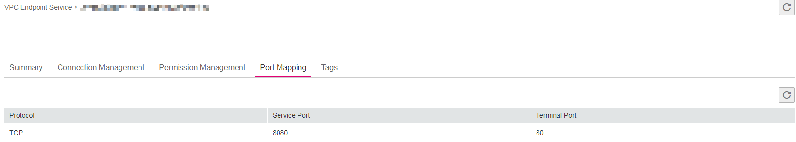

# Viewing Port Mappings

## Scenarios

This section describes how to view existing port mappings.

## Procedure

1.  Log in to the management console.
2.  Click    in the upper left corner and select the desired region and project.

1.  Click  **Service List**  and choose  **VPC Endpoint**  under  **Network**.

1.  In the navigation pane on the left, choose  **VPC Endpoint**  \>  **VPC Endpoint Services**.
2.  In the VPC endpoint service list, locate the target VPC endpoint service and click its name.
3.  On the displayed page, select the  **Port Mapping**  tab.

    All added port mappings are displayed.

    **Figure  1**  Port Mapping  
    

