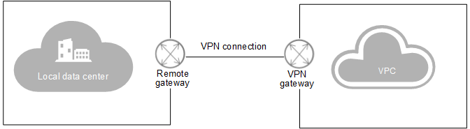
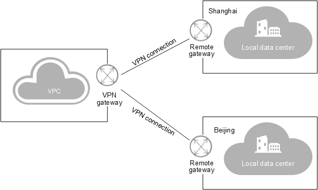

# Application Scenarios

With the VPN between the VPC and your traditional data center, you can easily use the ECSs and block storage resources provided by the cloud platform. Applications can be migrated to the cloud and additional web servers can be deployed to increase the computing capacity on a network. In this way, a hybrid cloud is built, which reduces IT O&M costs and protects enterprise core data from being leaked.

The VPN service allows you to set up site-to-site VPN connections or VPN connections from one site to multiple sites.

## Site-to-site VPN connection

You can set up a VPN to connect a local data center to a VPC, thus building a hybrid cloud.  [Figure 1](#fig234964913366)  shows a site-to-site VPN connection.

**Figure  1**  Site-to-site VPN connection  

## VPN connection from one site to multiple sites

You can also set up a VPN to connect multiple local data centers to a VPC, thus building a hybrid cloud.  [Figure 2](#fig8311841131918)  shows a VPN connection from one site to multiple sites.

> **NOTE:**   
>The subnet CIDR blocks of each site involved in the VPN connection cannot overlap.  

**Figure  2**  VPN connection from one site to multiple sites  

