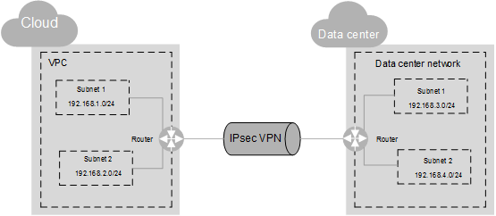

# Connecting to a VPC Through a VPN

## **Scenarios**

By default, ECSs in a VPC cannot communicate with your data center or private network. To enable communication between them, use a VPN. After a VPN is created, configure the security group and check the connectivity between the local and remote networks to ensure that the VPN is available. VPNs can be classified into the following two types:

-   Site-to-site VPN: The local side is a VPC on the cloud service platform, and the remote side is a user data center. A site-to-site VPN is a communication tunnel between a user data center and a single VPC.
-   Hub-and-spoke VPN: The local side is a VPC on the cloud service platform, and the remote side is user data centers. A hub-and-spoke VPN is a communication tunnel between user data centers and a VPC.

Ensure that the following requirements are met when configuring a VPN:

-   The local and remote subnets cannot overlap.
-   Different local subnets cannot overlap.
-   The local and remote sides use the same IKE and IPsec policies and PSK.
-   The local and remote subnet and gateway parameters must be symmetric.
-   The security group used by ECSs in the VPC allows traffic from and to the remote side.
-   After a VPN is created, its status changes to  **Normal**  only after the VMs or physical servers on the two sides of the VPN communicate with each other. 

## **Prerequisites**

You have created the VPC and subnet required by the VPN.

## **Procedure**

1.  On the management console, select the appropriate IKE and IPsec policies to create a VPN.
2.  Check the IP address pools for the local and remote subnets.

    In  [Figure 1](#fig1141735616), a VPC has two subnets: 192.168.1.0/24 and 192.168.2.0/24. On your router deployed in your physical data center, you also have two subnets: 192.168.3.0/24 and 192.168.4.0/24. You can create a VPN to enable subnets in your VPC to communicate with those in your data center.

    **Figure  1**  IPsec VPN  
    

    The IP address pools for the local and remote subnets cannot overlap with each other. For example, if the local VPC has two subnets, 192.168.1.0/24 and 192.168.2.0/24, the IP address pool for the remote subnets cannot contain these two subnets.

3.  Configure security group rules for the VPC.
4.  Check the security group of the VPC.

    The security group must allow packets from the VPN to pass. You can run the  **ping**  command to check whether the security group of the VPC allows packets from the VPN to pass.

5.  Check the remote LAN configuration \(network configuration of the remote data center\).

    A route must be configured for the remote LAN to enable VPN traffic to be forwarded to network devices on the LAN. If the VPN traffic cannot be forwarded to the network devices, check whether the remote LAN has policies configured to refuse the traffic.

