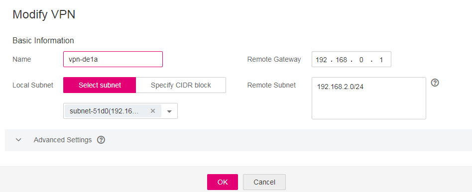

# Modifying a VPN

## **Scenarios**

If the VPN network information conflicts the VPC network information or you need to adjust VPN configurations, you can modify a VPN.

## **Procedure**

1.  Log in to the management console.
2.  Click    in the upper left corner and select a region and project.
3.  On the console homepage, under  **Network**, click  **Virtual Private Network**.
4.  On the  **Virtual Private Network**  page, locate the target VPN and click  **Modify**.
5.  In the displayed dialog box, set parameters as prompted.

    **Figure  1**  Modifying a VPN  
    

6.  Click  **OK**.

