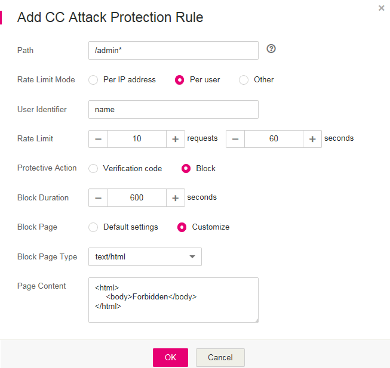

# Configuring CC Attack Protection Rules

This section describes how to configure CC attack protection rules.

With these rules, rate limiting policies are set based on the IP addresses, cookies, or Referer field to accurately identify and mitigate  CC attacks.

## Prerequisites

-   Login credentials have been obtained.
-   The domain name to be protected has been created.

## Procedure

1.  Log in to the management console.
2.  Click    in the upper left corner of the management console and select a region or project.
3.  Click  **Service List**  at the top of the page and choose  **Security**  \>  **Web Application Firewall**. In the navigation pane, choose  **Domains**. The  **Domains**  page is displayed, as shown in  [Figure 1](#waf_01_0008_fig164792010154510).

    **Figure  1**  Entrance to the domain configuration page  
    

4.  In the  **Operation**  column of the row containing the target domain name, click  **Configure Policy**. The protection configuration page is displayed, as shown in  [Figure 2](#waf_01_0008_fig16197124372015).

    **Figure  2**  Protection configuration page  
    

5.  In the  **CC Attack Protection**  configuration area, change  **Status**  as needed and then click  **Save**  in the upper right corner of the  **Protection Status**  list. In the dialog box displayed, click  **Yes**  to save the settings. Otherwise, click  **Cancel**. See  [Figure 3](#fig102851827142620).

    **Figure  3**  CC Attack Protection configuration area  
    

6.  Click  **Customize Rule**. On the displayed page, click  **Add Rule**  in the upper left corner to add a CC attack protection rule. See  [Figure 4](#fig115115503317).

    > **NOTE:**   
    >If you do not click  **Save**  after changing  **Status**  in  [step 5](#li54077254163213), the  **Warning**  dialog box is displayed when you click  **Customize Rule**.  
    >-   Click  **Yes**  to cancel the previous settings.  
    >-   Click  **No**  and then  **Save**  to save the settings.  

    WAF creates a default CC attack protection rule. The rule can be modified but cannot be deleted.  **Rate Limit**  in the rule is 500 requests/5 seconds by default and it can be adjusted up to 10000 requests/5 seconds. If you want a higher rate limit than the maximum value, contact the administrator.

    **Figure  4**  Add Rule \(CC Attack Protection\)  
    .png "add-rule-(cc-attack-protection)")

7.  In the displayed dialog box shown in  [Figure 5](#fig8736181862118), specify the parameters by referring to  [Table 1](#table19744111819217).

    **Figure  5**  Adding a CC attack protection rule  
    

    **Table  1**  Rule parameters

    
    <table><thead align="left"><tr id="row137372018152111"><th class="cellrowborder" valign="top" width="19%" id="mcps1.2.4.1.1">
Parameter

    </th>
    <th class="cellrowborder" valign="top" width="50.88%" id="mcps1.2.4.1.2">
Description

    </th>
    <th class="cellrowborder" valign="top" width="30.12%" id="mcps1.2.4.1.3">
Example Value

    </th>
    </tr>
    </thead>
    <tbody><tr id="row1373871812117"><td class="cellrowborder" valign="top" width="19%" headers="mcps1.2.4.1.1 ">
Path

    </td>
    <td class="cellrowborder" valign="top" width="50.88%" headers="mcps1.2.4.1.2 ">
URL excluding a domain name

    <ul id="ul1515617591337"><li>Prefix match: The path ending with * indicates that the path is used as a prefix. For example, if the path to be protected is <strong id="b147631916184_1">/admin/test.php</strong> or <strong id="b1368516691812_1">/adminabc</strong>, set <strong id="b3514135671817_1">Path</strong> to <b>/admin*</b>.</li><li>Exact match: The path to be entered must match the path to be protected. If the path to be protected is <b>/admin</b>, set <strong id="b842352706142234">Path</strong> to <b>/admin</b>.</li></ul>
    
 NOTE: 
<ul id="ul20707155819344"><li>The path supports prefix and exact matches only and does not support regular expressions.</li><li>The path cannot contain two or more consecutive slashes. For example, <b>///admin</b>. If you enter <strong id="b7509330174115">///admin</strong>, the WAF engine converts <strong id="b8509153018410">///</strong> to <strong id="b1150911301417">/</strong>.</li></ul>
    

    </td>
    <td class="cellrowborder" valign="top" width="30.12%" headers="mcps1.2.4.1.3 ">
<strong id="b474314318528">/admin*</strong>

    </td>
    </tr>
    <tr id="row1773971812119"><td class="cellrowborder" valign="top" width="19%" headers="mcps1.2.4.1.1 ">
Rate Limit Mode

    </td>
    <td class="cellrowborder" valign="top" width="50.88%" headers="mcps1.2.4.1.2 "><ul id="ul77394180214"><li><strong id="b842352706113154">Per IP address</strong>: A web visitor is identified by the IP address.</li><li><strong id="b84235270617197">Per user</strong>: A web visitor is identified by the cookie key value.</li><li><strong id="b13627924151612">Other</strong>: A web visitor is identified by the Referer field (user-defined request source).
 NOTE: 

If <strong id="b1419813094415">Rate Limit Mode</strong> is <strong id="b1726153412446">Other</strong>, <strong id="b11679262444">Content</strong> of <strong id="b026113854417">Referer</strong> is set to a complete URL containing the domain name. The <strong id="b2046414444510">Content</strong> field supports prefix match and exact match only, and cannot contain two or more consecutive slashes, for example, <strong id="b105281836144615">///admin</strong>. If you enter <strong id="b2279355194618">///admin</strong>, the WAF engine converts it to <strong id="b321772064712">/admin</strong>.

    
For example, if <strong id="b12025287466">Path</strong> is <strong id="b63908694613">/admin</strong> and you do not want visitors to access the page from <strong id="b93901634612">www.test.com</strong>, set <strong id="b183902604610">Content</strong> to <strong id="b239018610464">http://www.test.com</strong>.

    

    </li></ul>
    </td>
    <td class="cellrowborder" valign="top" width="30.12%" headers="mcps1.2.4.1.3 ">
<strong id="b18912182193618">Per user</strong>

    </td>
    </tr>
    <tr id="row8739818162118"><td class="cellrowborder" valign="top" width="19%" headers="mcps1.2.4.1.1 ">
User Identifier

    </td>
    <td class="cellrowborder" valign="top" width="50.88%" headers="mcps1.2.4.1.2 ">
A cookie field that you need to set if <strong id="b1482117374596">Rate Limit Mode</strong> is <strong id="b158297373595">Per user</strong>. This value supports exact match only and does not support regular expressions.

    
If a website uses the <strong id="b328185111497">name</strong> field in the cookie to uniquely identify a web visitor, enter <strong id="b1319481524">name</strong>. If you do not set this value, WAF will automatically assign one.

    </td>
    <td class="cellrowborder" valign="top" width="30.12%" headers="mcps1.2.4.1.3 ">
<strong id="b842352706175455">name</strong>

    </td>
    </tr>
    <tr id="row0741101862119"><td class="cellrowborder" valign="top" width="19%" headers="mcps1.2.4.1.1 ">
Rate Limit

    </td>
    <td class="cellrowborder" valign="top" width="50.88%" headers="mcps1.2.4.1.2 ">
Number of requests allowed from a web visitor in the rate limiting period. The visitor's access request is denied if the limit is reached. 

    </td>
    <td class="cellrowborder" valign="top" width="30.12%" headers="mcps1.2.4.1.3 ">
<strong id="b418225811492">10</strong> requests <strong id="b1128928504">60</strong> seconds

    </td>
    </tr>
    <tr id="row6741418122113"><td class="cellrowborder" valign="top" width="19%" headers="mcps1.2.4.1.1 ">
Protective Action

    </td>
    <td class="cellrowborder" valign="top" width="50.88%" headers="mcps1.2.4.1.2 ">
Action to perform if the maximum number of requests is reached. Options are <strong id="b842352706113641">Verification code</strong> and <strong id="b842352706113644">Block</strong>.

    <ul id="ul374111183213"><li class="MsoBodyText"><strong id="b84235270616218">Verification code</strong>: A verification code is displayed when the number of requests reaches the maximum limit within a specified period. Upon completing the verification, you are no longer restricted by the maximum number of requests allowed.</li><li class="MsoBodyText"><strong id="b84235270616156">Block</strong>: Requests are blocked if the maximum number of requests is reached.
 NOTE: 

If <strong id="b12911181920812">Rate Limit Mode</strong> is <strong id="b179116192818">Other</strong>, <strong id="b1091121919817">Protective Action</strong> can only be <strong id="b1391131917811">Block</strong>.

    

    </li></ul>
    </td>
    <td class="cellrowborder" valign="top" width="30.12%" headers="mcps1.2.4.1.3 ">
<strong id="b84235270617552">Block</strong>

    </td>
    </tr>
    <tr id="row1274120181210"><td class="cellrowborder" valign="top" width="19%" headers="mcps1.2.4.1.1 ">
Block Duration

    </td>
    <td class="cellrowborder" valign="top" width="50.88%" headers="mcps1.2.4.1.2 ">
Time required for the page to be restored to normal state after being blocked

    </td>
    <td class="cellrowborder" valign="top" width="30.12%" headers="mcps1.2.4.1.3 ">
<strong id="b1014032417533">600</strong> seconds

    </td>
    </tr>
    <tr id="row8744101812218"><td class="cellrowborder" valign="top" width="19%" headers="mcps1.2.4.1.1 ">
Block Page

    </td>
    <td class="cellrowborder" valign="top" width="50.88%" headers="mcps1.2.4.1.2 ">
Error page displayed when the maximum number of requests has been reached. This parameter is set only when <strong id="b185243972419">Protective Action</strong> is <strong id="b875517426248">Block</strong>.

    <ul id="ul15743111812116"><li>If you select <strong id="b1542916259">Default settings</strong>, the default block page is displayed.</li><li>If you select <strong id="b9715913245">Customize</strong>, set a custom message.</li></ul>
    </td>
    <td class="cellrowborder" valign="top" width="30.12%" headers="mcps1.2.4.1.3 ">
<strong id="b1762118882414">Customize</strong>

    </td>
    </tr>
    <tr id="row157442018202118"><td class="cellrowborder" valign="top" width="19%" headers="mcps1.2.4.1.1 ">
Block Page Type

    </td>
    <td class="cellrowborder" valign="top" width="50.88%" headers="mcps1.2.4.1.2 ">
If you select <strong id="b84235270611431">Customize</strong> for <strong id="b84235270611435">Block Page</strong>, select a type of the block page among options <strong id="b842352706114240">application/json</strong>, <strong id="b842352706114245">text/html</strong>, and <strong id="b842352706114249">text/xml</strong>.

    </td>
    <td class="cellrowborder" valign="top" width="30.12%" headers="mcps1.2.4.1.3 ">
<strong id="b16761111417312">text/html</strong>

    </td>
    </tr>
    <tr id="row1574471819217"><td class="cellrowborder" valign="top" width="19%" headers="mcps1.2.4.1.1 ">
Page Content

    </td>
    <td class="cellrowborder" valign="top" width="50.88%" headers="mcps1.2.4.1.2 ">
If you select <strong id="b1677346641114332">Customize</strong> for <strong id="b1140464710114332">Block Page</strong>, set the content to be returned.

    </td>
    <td class="cellrowborder" valign="top" width="30.12%" headers="mcps1.2.4.1.3 ">
<strong id="b842352706175530">&lt;html&gt;&lt;body&gt;Forbidden&lt;/body&gt;&lt;/html&gt;</strong>

    </td>
    </tr>
    </tbody>
    </table>

8.  Click  **OK**. The added CC attack protection rule is displayed in the rule list.
    -   To modify the added rule, click  **Modify**  in the row containing the target rule.
    -   The default CC attack protection rule created by WAF can be modified but cannot be deleted.
    -   To delete the added rule, click  **Delete**  in the row containing the target rule.

