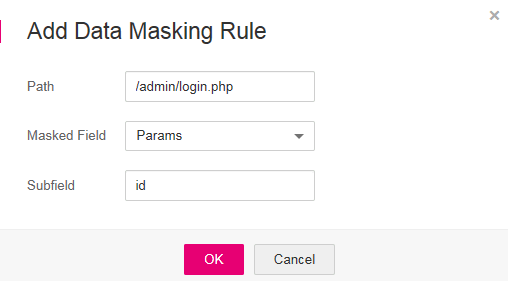

# Configuring Data Masking Rules

This section describes how to configure data masking rules.  Data Masking  prevents such data as usernames and passwords from being displayed in event logs.

## Prerequisites

-   Login credentials have been obtained.
-   The domain name to be protected has been created.

## Procedure

1.  Log in to the management console.
2.  Click    in the upper left corner of the management console and select a region or project.
3.  Click  **Service List**  at the top of the page and choose  **Security**  \>  **Web Application Firewall**. In the navigation pane, choose  **Domains**. The  **Domains**  page is displayed, as shown in  [Figure 1](#waf_01_0008_fig164792010154510).

    **Figure  1**  Entrance to the domain configuration page  
    

4.  In the  **Operation**  column of the row containing the target domain name, click  **Configure Policy**. The protection configuration page is displayed, as shown in  [Figure 2](#waf_01_0008_fig16197124372015).

    **Figure  2**  Protection configuration page  
    

5.  In the  **Data Masking**  configuration area, change  **Status**  as needed and then click  **Save**  in the upper right corner of the  **Protection Status**  list. In the dialog box displayed, click  **Yes**  to save the settings. Otherwise, click  **Cancel**. See  [Figure 3](#fig163378412590).

    **Figure  3**  Data Masking configuration area  
    

6.  Click  **Customize Rule**. On the displayed page, click  **Add Rule**  in the upper left corner to add a data masking rule. See  [Figure 4](#fig187391447920).

    > **NOTE:**   
    >If you do not click  **Save**  after changing  **Status**  in  [step 5](#li45442459125143), the  **Warning**  dialog box is displayed when you click  **Customize Rule**.  
    >-   Click  **Yes**  to cancel the previous settings.  
    >-   Click  **No**  and then  **Save**  to save the settings.  

    **Figure  4**  Add Rule \(Data Masking\)  
    .png "add-rule-(data-masking)")

7.  In the displayed dialog box shown in  [Figure 5](#fig49385421125519), specify the parameters by referring to  [Table 1](#table4696626918715).

    **Figure  5**  Adding a data masking rule  
    

    **Table  1**  Rule parameters

    
    <table><thead align="left"><tr id="row151760118715"><th class="cellrowborder" valign="top" width="15.85%" id="mcps1.2.4.1.1">
Parameter

    </th>
    <th class="cellrowborder" valign="top" width="52.2%" id="mcps1.2.4.1.2">
Description

    </th>
    <th class="cellrowborder" valign="top" width="31.95%" id="mcps1.2.4.1.3">
Example Value

    </th>
    </tr>
    </thead>
    <tbody><tr id="row125751318715"><td class="cellrowborder" valign="top" width="15.85%" headers="mcps1.2.4.1.1 ">
Path

    </td>
    <td class="cellrowborder" valign="top" width="52.2%" headers="mcps1.2.4.1.2 ">
URL excluding a domain name

    <ul id="ul1515617591337"><li>Prefix match: The path ending with * indicates that the path is used as a prefix. For example, if the path to be protected is <strong id="b174531018122">/admin/test.php</strong> or <strong id="b164537185220">/adminabc</strong>, set <strong id="b184531918121">Path</strong> to <b>/admin*</b>.</li><li>Exact match: The path to be entered must match the path to be protected. If the path to be protected is <b>/admin</b>, set <strong id="b05781021825">Path</strong> to <b>/admin</b>.</li></ul>
    
 NOTE: 
<ul id="ul20707155819344"><li>The path supports prefix and exact matches only and does not support regular expressions.</li><li>The path cannot contain two or more consecutive slashes. For example, <b>///admin</b>. If you enter <strong id="b981419256582">///admin</strong>, the WAF engine converts <strong id="b1081415253585">///</strong> to <strong id="b19814122511589">/</strong>.</li></ul>
    

    </td>
    <td class="cellrowborder" valign="top" width="31.95%" headers="mcps1.2.4.1.3 ">
<strong id="b240272934615">/admin/login.php</strong>

    
For example, if the URL to be protected is <b>http://www.example.com/admin/login.php</b>, set <strong id="b1723129201">Path</strong> to <strong id="b12191272014">/admin/login.php</strong>.

    </td>
    </tr>
    <tr id="row12212154685910"><td class="cellrowborder" valign="top" width="15.85%" headers="mcps1.2.4.1.1 ">
Masked Field

    </td>
    <td class="cellrowborder" valign="top" width="52.2%" headers="mcps1.2.4.1.2 ">
A field set to be masked<ul id="ul16778520183811"><li><strong id="b1343103515012">Params</strong>: A request parameter</li><li><strong id="b3268543155016">Header</strong>: A user-defined HTTP header</li></ul>
    

    </td>
    <td class="cellrowborder" rowspan="2" valign="top" width="31.95%" headers="mcps1.2.4.1.3 "><ul id="ul3574205795514"><li>If <strong id="b33911257154612">Masked Field</strong> is <strong id="b16810122213477">Params</strong>, set <strong id="b15130102919477">Subfield</strong> according to your actual needs. If it is set to <strong id="b9644145594714">id</strong>, content that matches <strong id="b786051518488">id</strong> is masked.</li><li>If <strong id="b1579816587">Masked Field</strong> is <b>Header</b>, set <b>Subfield</b> according to your actual needs. If it is set to <b>Accept</b>, content that matches <b>Accept</b> is masked.</li></ul>
    </td>
    </tr>
    <tr id="row3251580618715"><td class="cellrowborder" valign="top" headers="mcps1.2.4.1.1 ">
Subfield

    </td>
    <td class="cellrowborder" valign="top" headers="mcps1.2.4.1.2 ">
Set the parameter based on <strong id="b771614580578">Masked Field</strong>. The masked field will not be displayed in the log.

    
 NOTICE: 

The length of a subfield cannot exceed 2048 bytes. Only digits, letters, underscores (_), and hyphens (-) are allowed.

    

    </td>
    </tr>
    </tbody>
    </table>

8.  Click  **OK**.
    -   To modify the added rule, click  **Modify**  in the row containing the target rule.
    -   To delete the added rule, click  **Delete**  in the row containing the target rule.

