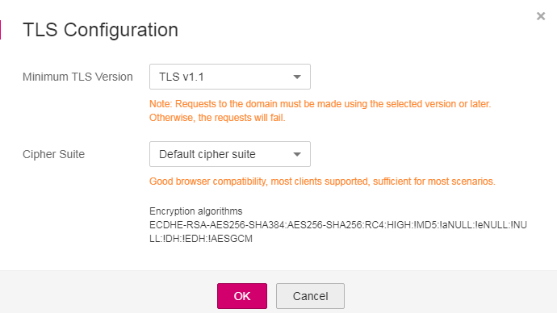

# Configuring the Minimum TLS Version and Cipher Suite

The Transport Layer Security \(TLS\) protocol provides confidentiality and integrity of data sent between applications over the Internet. HTTPS is a network protocol constructed based on TLS and HTTP for encrypted transmission and identity authentication. When  **Client Protocol**  for a domain name to be protected is set to  **HTTPS**, you can use WAF to set the minimum TLS version and cipher suite \(a set of cryptographic algorithms\) for the domain name. All requests using the TLS earlier than the minimum TLS version cannot access the protected domain names so that your service is secured.

If  **Client Protocol**  for the domain name to be protected is set to  **HTTP**, TLS is not involved. In this case, skip this section.

TLS v1.1 and the default cipher suite are configured by default in WAF for general security. To better protect your services, you are advised to set the minimum TLS version to a later version and cipher suite to the one having higher security.

## Prerequisites

-   The domain name to be protected has been added.
-   **Client Protocol**  is set to  **HTTPS**  for the protected domain name.

## Procedure

1.  Log in to the management console.
2.  Click    in the upper left corner of the management console and select a region or project.
3.  Click  **Service List**  in the upper right corner of the page and choose  **Security**  \>  **Web Application Firewall**  \>  **Domains**.

    **Figure  1**  Entrance to  **Domains**  
    

4.  In the  **Name**  column, click the target domain name to go to the basic information page.
5.  Click    next to the cipher suite name in the row where  **TLS Configuration**  locates.

    **Figure  2**  Modifying TLS configurations  
    

6.  In the  **TLS Configuration**  dialog box, select the minimum TLS version and cipher suite.  [Table 1](#table205284916443)  describes the parameters.

    **Figure  3**  TLS Configuration  
    

    **Table  1**  TLS configuration parameters

    
    <table><thead align="left"><tr id="row1352813913442"><th class="cellrowborder" valign="top" width="25.5%" id="mcps1.2.3.1.1">
Parameter

    </th>
    <th class="cellrowborder" valign="top" width="74.5%" id="mcps1.2.3.1.2">
Description

    </th>
    </tr>
    </thead>
    <tbody><tr id="row125291984418"><td class="cellrowborder" valign="top" width="25.5%" headers="mcps1.2.3.1.1 ">
Minimum TLS Version

    </td>
    <td class="cellrowborder" valign="top" width="74.5%" headers="mcps1.2.3.1.2 ">
Minimum TLS version for accessing the protected domain name

    <ul id="ul88021419192214"><li>TLS v1.1: Requests using TLS v1.1 or later can access the domain name.</li><li>TLS v1.2: Requests using TLS v1.2 or later can the access domain name.</li></ul>
    
 NOTICE: 

Cipher suite 2 is not supported if TLS v1.1 is selected.

    

    </td>
    </tr>
    <tr id="row8586125264411"><td class="cellrowborder" valign="top" width="25.5%" headers="mcps1.2.3.1.1 ">
Cipher Suite

    </td>
    <td class="cellrowborder" valign="top" width="74.5%" headers="mcps1.2.3.1.2 "><ul id="ul057093310216"><li><strong id="b120917538103">Default cipher suite</strong>: Good browser compatibility, most clients supported, sufficient for most scenarios</li><li><strong id="b14522731151117">Cipher suite 1</strong>: Recommended configuration, best combination of compatibility and security</li><li><strong id="b101363559137">Cipher suite 2</strong>: Strict compliance with forward secrecy requirements of PCI DSS and excellent protection, but older browsers may be unable to access the websites</li><li><strong id="b2747911121412">Cipher suite 3</strong>: Support for ECDHE, DHE-GCM, and RSA-AES-GCM algorithms but not CBC</li></ul>
    </td>
    </tr>
    </tbody>
    </table>

7.  Click  **OK**.

