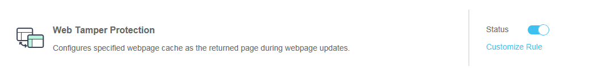

# Configuring Web Tamper Protection Rules

This section describes how to configure  web tamper protection \(WTP\)  rules.

You can configure these rules to prevent a static webpage from being tampered with.

WTP has the following advantages:

-   Quicker response to requests

    After a WTP rule is configured, WAF caches the static webpage on the server. When receiving a request from a web visitor, WAF returns the cached page to the visitor.

-   Web tamper protection

    If an attacker modifies a static webpage on the server, WAF returns the cached original webpage to web visitors, ensuring that visitors never access tampered-with pages.

    WAF can randomly extract a request from a web visitor to compare the requested page with the webpage on the server. If WAF detects that the page has been tampered with, it notifies the user by SMS or email. For details about alarm notification settings, see  [Enabling Alarm Notification](enabling-alarm-notification.md).

## Prerequisites

-   Login credentials have been obtained.
-   The domain name to be protected has been created.

## Procedure

1.  Log in to the management console.
2.  Click    in the upper left corner of the management console and select a region or project.
3.  Click  **Service List**  at the top of the page and choose  **Security**  \>  **Web Application Firewall**. In the navigation pane, choose  **Domains**. The  **Domains**  page is displayed, as shown in  [Figure 1](#waf_01_0008_fig164792010154510).

    **Figure  1**  Entrance to the domain configuration page  
    

4.  In the  **Operation**  column of the row containing the target domain name, click  **Configure Policy**. The protection configuration page is displayed, as shown in  [Figure 2](#waf_01_0008_fig16197124372015).

    **Figure  2**  Protection configuration page  
    

5.  In the  **Web Tamper Protection**  configuration area, change  **Status**  as needed and then click  **Save**  in the upper right corner of the  **Protection Status**  list. In the dialog box displayed, click  **Yes**  to save the settings. Otherwise, click  **Cancel**. See  [Figure 3](#fig10572033304).

    **Figure  3**  Web Tamper Protection configuration area  
    

6.  Click  **Customize Rule**. On the displayed page, click  **Add Rule**  in the upper left corner to add a web tamper protection rule. See  [Figure 4](#fig13289432775).

    > **NOTE:**   
    >If you do not click  **Save**  after changing  **Status**  in  [step 5](#li58723545102836), the  **Warning**  dialog box is displayed when you click  **Customize Rule**.  
    >-   Click  **Yes**  to cancel the previous settings.  
    >-   Click  **No**  and then  **Save**  to save the settings.  

    **Figure  4**  Add Rule \(Web Tamper Protection\)  
    .png "add-rule-(web-tamper-protection)")

7.  In the displayed dialog box shown in  [Figure 5](#fig13729129125420), specify the parameters by referring to  [Table 1](#table2046816299203).

    **Figure  5**  Adding a web tamper protection rule  
    

    **Table  1**  Rule parameters

    
    <table><thead align="left"><tr id="row546914299207"><th class="cellrowborder" valign="top" width="23%" id="mcps1.2.4.1.1">
Parameter

    </th>
    <th class="cellrowborder" valign="top" width="37.15%" id="mcps1.2.4.1.2">
Description

    </th>
    <th class="cellrowborder" valign="top" width="39.85%" id="mcps1.2.4.1.3">
Example Value

    </th>
    </tr>
    </thead>
    <tbody><tr id="row13866404146"><td class="cellrowborder" valign="top" width="23%" headers="mcps1.2.4.1.1 ">
Domain Name

    </td>
    <td class="cellrowborder" valign="top" width="37.15%" headers="mcps1.2.4.1.2 ">
Domain name to be protected

    </td>
    <td class="cellrowborder" valign="top" width="39.85%" headers="mcps1.2.4.1.3 ">
<strong id="b17216759131516">www.example.com</strong>

    </td>
    </tr>
    <tr id="row1247062911209"><td class="cellrowborder" valign="top" width="23%" headers="mcps1.2.4.1.1 ">
Path

    </td>
    <td class="cellrowborder" valign="top" width="37.15%" headers="mcps1.2.4.1.2 ">
URL excluding a domain name

    
 NOTE: 
<ul id="ul20707155819344"><li>The path does not support regular expressions.</li><li>The path cannot contain two or more consecutive slashes. For example, <b>///admin</b>. If you enter <strong id="b1188518304517">///admin</strong>, the WAF engine converts <strong id="b38850301511">///</strong> to <strong id="b168856302052">/</strong>.</li></ul>
    

    </td>
    <td class="cellrowborder" valign="top" width="39.85%" headers="mcps1.2.4.1.3 ">
<strong id="b177644110299">/admin</strong>

    
For example, if the URL to be protected is <b>http://www.example.com/admin</b>, set <strong id="b19427477917">Path</strong> to <strong id="b1885651497">/admin</strong>.

    </td>
    </tr>
    </tbody>
    </table>

8.  Click  **OK**.
    -   In the event of changes on the protected webpage, WAF needs to re-cache the webpage content. In this case, click  **Update Cache**  in the row containing the target rule.
    -   To delete the added rule, click  **Delete**  in the row containing the target rule.

