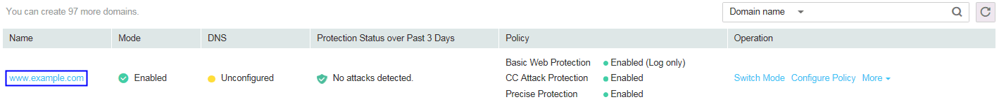
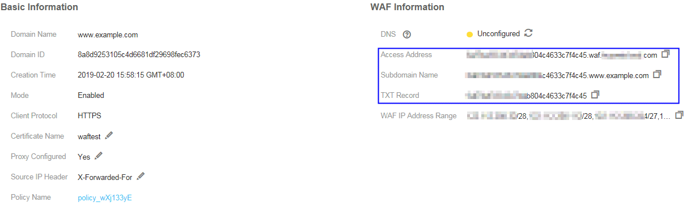

# Connecting a Domain Name to WAF

This section describes how to  connect a domain name to WAF  so that website traffic passes through WAF.

To ensure that WAF works properly, you are advised to test WAF by following the instructions in  [Testing WAF](testing-waf.md)  before performing this operation.

## How WAF Works

-   No proxy used

    DNS resolves your domain name to the origin server IP address before the site is moved to WAF. DNS resolves your domain name to the CNAME of WAF after the site is moved to WAF. Then WAF filters out illegitimate traffic and only routes legitimate traffic back to the origin server.

-   A proxy \(such as AAD\) used

    DNS resolves the domain name to the AAD IP address before your site is moved to WAF. In this case, the traffic passes through AAD and then AAD routes the traffic back to the origin server. After your site is moved to WAF, change the AAD back-to-source IP address to the access address of WAF and add a subdomain name and TXT record to the DNS records of your DNS provider for WAF to take effect. In this way, AAD forwards the traffic to WAF. WAF then filters out illegitimate traffic and only routes legitimate traffic back to the origin server.

## Prerequisites

-   Login credentials have been obtained.
-   A domain name has been created but not connected to WAF.

## Procedure

1.  Log in to the management console.
2.  Click    in the upper left corner of the management console and select a region or project.
3.  Click  **Service List**  at the top of the page and choose  **Security**  \>  **Web Application Firewall**. In the navigation pane, choose  **Domains**. The  **Domains**  page is displayed, as shown in  [Figure 1](#en-us_topic_0154713166_f6b9e0be38f9b4498a46fea967ef351ae).

    **Figure  1** **Domains**  page  
    

4.  In the  **Name**  column, click the target domain name. Its information is displayed.

    -   Without a proxy
        1.  In the  **CNAME**  row, click    to copy the CNAME value.

            **Figure  2**  CNAME value  
            

        1.  Go to your DNS provider and configure the CNAME record. For details, contact your DNS provider.

            > **NOTICE:**   
            >The high availability of our system, which is based on multi-AZ deployments to support both active-active and disaster recovery, relies on the WAF CNAME record. Therefore,  
            >1.  Do not modify the hosts file. Add the CNAME record directly to the DNS records of your DNS provider.  
            >2.  Do not use the A record to replace the CNAME record.  

            The CNAME binding method of some common DNS providers is listed for your reference. If the following configuration is inconsistent with the actual configuration, rely on information provided by the DNS providers.

            1.  Log in to the management console of the DNS provider.
            2.  Go to the domain resolution record page.
            3.  Set the CNAME resolution record.
                -   Set the record type to  **CNAME**.
                -   Generally, enter the domain name prefix in the host record. For example, if the protected domain name is  **admin.demo.com**, enter  **admin**  in the host record.
                -   The record value is the CNAME generated by WAF.
                -   Resolution line: keep the default value  **TTL**.

            4.  Click  **Save**.

            > **NOTICE:**   
            >The preceding resolution methods are provided by third parties. This document does not control or assume responsibility for any third party content, including but not limited to its accuracy, compatibility, reliability, availability, legitimacy, appropriateness, performance, non-infringement, or status update, unless otherwise specified in this document.  

        2.  Verify that the CNAME has been configured.
            1.  In Windows, choose  **Start**  \>  **Run**. Then enter  **cmd**  and press  **Enter**.
            2.  Run the following command to query the CNAME. If the configured CNAME is displayed, the configuration is successful.

                **nslookup www.**_domain_**.com**

    -   With a proxy
        1.  Click    in the  **Access Address**,  **Subdomain Name**, and  **TXT Record**  to copy the required values, respectively.

            **Figure  3**  Copying the access address and TXT record  
            

        2.  Change the back-to-source address of the proxy \(such as AAD or CDN\) to the copied access address. Add a subdomain name and TXT record to the DNS records of your DNS provider. Then, the domain name is connected to WAF and traffic passes through WAF.

            > **NOTICE:**   
            >The high availability of our system, which is based on multi-AZ deployments to support both active-active and disaster recovery, relies on the WAF CNAME record.  

    > **NOTE:**   
    >By default, WAF detects the DNS status of each protected domain name hourly. If you have performed domain connection and  **DNS**  is  **Normal**, the domain name has been connected to WAF.  

