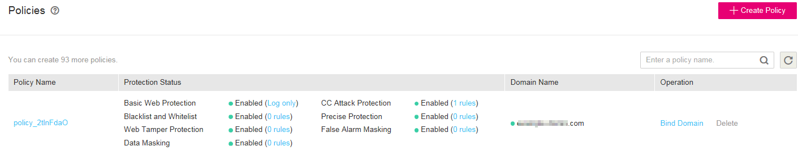

# Creating a Policy

A policy is a combination of multiple rules, such as basic web protection, blacklist or whitelist, and precise protection rules. A policy can be applied to multiple domain names. This section describes how to create a policy.

## Prerequisites

Login credentials have been obtained.

## Procedure

1.  Log in to the management console.
2.  Click    in the upper left corner of the management console and select a region or project.
3.  Choose  **Security**  \>  **Web Application Firewall**. In the navigation pane, choose  **Policies**. The  **Policies**  page is displayed.

1.  Click  **Create Policy**  in the upper right corner of the list. See  [Figure 1](#fig1769985133814).

    **Figure  1**  Creating a policy  
    

2.  In the dialog box displayed, enter a policy name and then click  **OK**. See  [Figure 2](#fig0843200133618).

    **Figure  2**  Create Policy dialog box  
    

3.  In the  **Policy Name**  column, click the target policy name. On the displayed page, add rules to the policy by referring to Section  [Rule Configurations](rule-configurations.md).

    **Figure  3**  Policies page  
    

    > **NOTE:**   
    >-   To modify a policy name, click    next to the target policy name. In the dialog box displayed, enter a new policy name.  
    >-   After a domain name is created, WAF protection is enabled by default. The mode of Basic Web Protection is  **Log only**  \(detected attacks are only logged but not blocked.\). By default, WAF creates a CC attack protection rule to the policy. The rule can be modified but cannot be deleted.  

