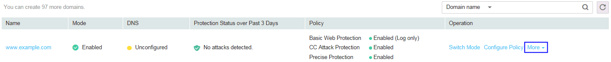

# Deleting a Domain Name

This section describes how to delete a domain name.

> **NOTICE:**   
>-   If the domain name to be deleted has been connected to WAF, re-resolve it with the DNS provider before you delete it to make it point to the origin server IP address. Otherwise, traffic intended to it will not be directed to the server, affecting access.  
>-   Deletion takes effect within 1 minute and deleted domain names cannot be recovered. Therefore, exercise caution when deleting a domain name.  

## Prerequisites

-   Login credentials have been obtained.
-   The domain name to be deleted is resolved to the origin server address.

## Procedure

1.  Log in to the management console.
2.  Click    in the upper left corner of the management console and select a region or project.
3.  Click  **Service List**  at the top of the page and choose  **Security**  \>  **Web Application Firewall**. In the navigation pane, choose  **Domains**. The  **Domains**  page is displayed.

    **Figure  1**  Domains  
    

4.  In the row containing the target domain name, choose  **More \> Delete**  in the  **Operation**  column. The  **Delete Domain**  dialog box is displayed.
    -   For the scenario where no proxy is used, see  [Figure 2](#fig11194454171217).

        > **NOTE:**   
        >-   After confirmation, select  **The CNAME of the domain name has been deleted from the DNS provider, and an A-record has been configured to the origin server IP address, or services carried on the domain name have been brought offline.**.  
        >-   If you want to retain the policy bound to the domain name, select  **Retain the policy of this domain name**.  

        **Figure  2**  Deleting a domain name \(without a proxy\)  
        .png "deleting-a-domain-name-(without-a-proxy)")

    -   For the scenario where a proxy is used, see  [Figure 3](#fig8903356111915).

        > **NOTE:**   
        >-   After confirmation, select  **The domain name has been pointed to the origin server on the Advanced Anti-DDoS, CDN, or cloud acceleration service side, or services carried on the domain name have been brought offline**.  
        >-   If you want to retain the policy bound to the domain name, select  **Retain the policy of this domain name**.  

        **Figure  3**  Deleting a domain name \(with a proxy\)  
        .png "deleting-a-domain-name-(with-a-proxy)")

5.  Click  **Yes**. If  **Domain deleted successfully**  is displayed in the upper right corner, the domain name is deleted.

