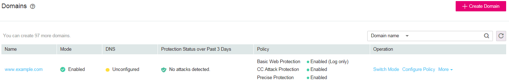

# Enabling WAF Protection

This section describes how to  enable WAF protection.

## Prerequisites

-   Login credentials have been obtained.
-   **Mode**  of the protected domain name is  **Disabled**  or  **Bypassed**.

## Procedure

1.  Log in to the management console.
2.  Click    in the upper left corner of the management console and select a region or project.
3.  Click  **Service List**  at the top of the page and choose  **Security**  \>  **Web Application Firewall**. In the navigation pane, choose  **Domains**. The  **Domains**  page is displayed, as shown in  [Figure 1](#f6b9e0be38f9b4498a46fea967ef351ae).

    **Figure  1**  Domains page  
    

4.  In the  **Operation**  column of the target domain name, click  **Switch Mode**.
5.  In the  **Switch Mode**  dialog box, select  **Enabled**  and then click  **OK**.

