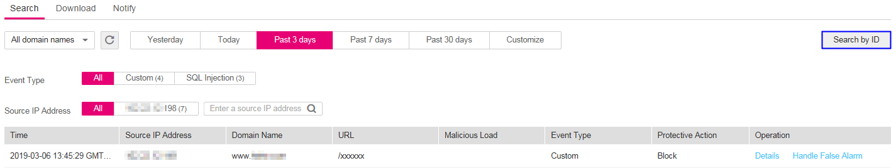
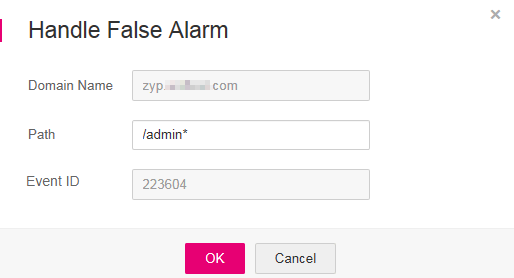

# Handling False Alarms

This section describes how to mask  false alarms  and view event details if you find out that an event is misreported.

## Prerequisites

-   Login credentials have been obtained.
-   The event list contains at least one misreported event.

## Procedure

1.  Log in to the management console.
2.  Click    in the upper left corner of the management console and select a region or project.
3.  Choose  **Security**  \>  **Web Application Firewall**. In the navigation pane, choose  **Events**. The  **Events**  page is displayed.
4.  Click the  **Search**  tab. In the domain name drop-down list, select a domain name or  **All domain names**  to view target event logs. The query time can be  **Yesterday**,  **Today**,  **Past 3 days**,  **Past 7 days**,  **Past 30 days**, or a user-defined time. See  [Figure 1](#fig194311743164914).  [Table 1](#table146358613417)  and  [Table 2](#table135241210519)  list related parameters.

    In the upper right corner of the event list, click  **Search by ID**  to search a target event by ID.

    **Figure  1**  Search tab page  
    

    **Table  1**  Event parameters

    
    <table><thead align="left"><tr id="row863606163419"><th class="cellrowborder" valign="top" width="35.809999999999995%" id="mcps1.2.3.1.1">
Parameter

    </th>
    <th class="cellrowborder" valign="top" width="64.19%" id="mcps1.2.3.1.2">
Description

    </th>
    </tr>
    </thead>
    <tbody><tr id="row18636563347"><td class="cellrowborder" valign="top" width="35.809999999999995%" headers="mcps1.2.3.1.1 ">
Event Type

    </td>
    <td class="cellrowborder" valign="top" width="64.19%" headers="mcps1.2.3.1.2 ">
Type of an attack

    
By default, <strong id="b19111135812559">All</strong> is selected. You can view logs of all attack types or select an attack type to view target attack logs.

    </td>
    </tr>
    <tr id="row1563616616349"><td class="cellrowborder" valign="top" width="35.809999999999995%" headers="mcps1.2.3.1.1 ">
Source IP Address

    </td>
    <td class="cellrowborder" valign="top" width="64.19%" headers="mcps1.2.3.1.2 ">
Public IP address of the web visitor/attacker

    
By default, <strong id="b16906126154519">All</strong> is selected. You can view logs of all attack source IP addresses, select an attack source IP address, or enter an attack source IP address to view target attack logs.

    </td>
    </tr>
    </tbody>
    </table>

    **Table  2**  Log list parameters

    
    <table><thead align="left"><tr id="row135266102011"><th class="cellrowborder" valign="top" width="35.199999999999996%" id="mcps1.2.3.1.1">
Parameter

    </th>
    <th class="cellrowborder" valign="top" width="64.8%" id="mcps1.2.3.1.2">
Description

    </th>
    </tr>
    </thead>
    <tbody><tr id="row152661018114"><td class="cellrowborder" valign="top" width="35.199999999999996%" headers="mcps1.2.3.1.1 ">
Time

    </td>
    <td class="cellrowborder" valign="top" width="64.8%" headers="mcps1.2.3.1.2 ">
Time when an attack occurs

    </td>
    </tr>
    <tr id="row352616101114"><td class="cellrowborder" valign="top" width="35.199999999999996%" headers="mcps1.2.3.1.1 ">
Source IP Address

    </td>
    <td class="cellrowborder" valign="top" width="64.8%" headers="mcps1.2.3.1.2 ">
Public IP address of the web visitor/attacker

    </td>
    </tr>
    <tr id="row652611010115"><td class="cellrowborder" valign="top" width="35.199999999999996%" headers="mcps1.2.3.1.1 ">
Domain Name

    </td>
    <td class="cellrowborder" valign="top" width="64.8%" headers="mcps1.2.3.1.2 ">
Attacked domain name

    </td>
    </tr>
    <tr id="row10526810313"><td class="cellrowborder" valign="top" width="35.199999999999996%" headers="mcps1.2.3.1.1 ">
URL

    </td>
    <td class="cellrowborder" valign="top" width="64.8%" headers="mcps1.2.3.1.2 ">
Attacked URL

    </td>
    </tr>
    <tr id="row635713296113"><td class="cellrowborder" valign="top" width="35.199999999999996%" headers="mcps1.2.3.1.1 ">
Malicious Load

    </td>
    <td class="cellrowborder" valign="top" width="64.8%" headers="mcps1.2.3.1.2 ">
Location of the malicious load

    </td>
    </tr>
    <tr id="row33596297111"><td class="cellrowborder" valign="top" width="35.199999999999996%" headers="mcps1.2.3.1.1 ">
Event Type

    </td>
    <td class="cellrowborder" valign="top" width="64.8%" headers="mcps1.2.3.1.2 ">
Type of an attack

    </td>
    </tr>
    <tr id="row17359429116"><td class="cellrowborder" valign="top" width="35.199999999999996%" headers="mcps1.2.3.1.1 ">
Protective Action

    </td>
    <td class="cellrowborder" valign="top" width="64.8%" headers="mcps1.2.3.1.2 ">
The options are <strong id="b13686123512297">Block</strong>, <strong id="b9686035102920">Log only</strong>, <strong id="b4687435102919">Allow</strong>, <strong id="b136881835162919">Verification code</strong>, <b>Filter</b>, and <b>Mismatch</b>.

    </td>
    </tr>
    </tbody>
    </table>

    > **NOTE:**   
    >To view event details, click  **Details**  in the  **Operation**  column of the event list.  

5.  If an event is misreported, add a false alarm masking rule by clicking  **Handle False Alarm**  in the row of the event.  [Figure 2](#fig16174064111318)  displays the  **Handle False Alarm**  dialog box.  [Table 3](#table35022095114540)  lists related parameters.

    > **NOTE:**   
    >False alarm masking only applies to events logged by built-in basic web protection rules. If you want to mask events logged by custom rules, delete the rules.  

    **Figure  2**  Handling a false alarm  
    

    **Table  3**  Parameter description

    
    <table><thead align="left"><tr id="row3795605114540"><th class="cellrowborder" valign="top" width="19.46%" id="mcps1.2.4.1.1">
Parameter

    </th>
    <th class="cellrowborder" valign="top" width="54.54%" id="mcps1.2.4.1.2">
Description

    </th>
    <th class="cellrowborder" valign="top" width="26%" id="mcps1.2.4.1.3">
Example Value

    </th>
    </tr>
    </thead>
    <tbody><tr id="row49117151114540"><td class="cellrowborder" valign="top" width="19.46%" headers="mcps1.2.4.1.1 ">
Domain Name

    </td>
    <td class="cellrowborder" valign="top" width="54.54%" headers="mcps1.2.4.1.2 ">
Domain name where an attack occurs, which is obtained automatically by the system

    </td>
    <td class="cellrowborder" valign="top" width="26%" headers="mcps1.2.4.1.3 ">
--

    </td>
    </tr>
    <tr id="row7791918114540"><td class="cellrowborder" valign="top" width="19.46%" headers="mcps1.2.4.1.1 ">
Path

    </td>
    <td class="cellrowborder" valign="top" width="54.54%" headers="mcps1.2.4.1.2 ">
Misreported URL excluding a domain name

    <ul id="ul1515617591337"><li>Prefix match: The path ending with * indicates that the path is used as a prefix. For example, if the path to be protected is <strong id="b1441113340528">/admin/test.php</strong> or <strong id="b15411183455219">/adminabc</strong>, set <strong id="b9411113425218">Path</strong> to <b>/admin*</b>.</li><li>Exact match: The path to be entered must match the path to be protected. If the path to be protected is <b>/admin</b>, set <strong id="b68353715529">Path</strong> to <b>/admin</b>.</li></ul>
    
 NOTE: 
<ul id="ul20707155819344"><li>The path supports prefix and exact matches only and does not support regular expressions.</li><li>The path cannot contain two or more consecutive slashes. For example, <b>///admin</b>. If you enter <strong id="b177054151416">///admin</strong>, the WAF engine converts <strong id="b57052015610">///</strong> to <strong id="b9705015212">/</strong>.</li></ul>
    

    </td>
    <td class="cellrowborder" valign="top" width="26%" headers="mcps1.2.4.1.3 ">
<strong id="b4333124435218">/admin*</strong>

    </td>
    </tr>
    <tr id="row6648026114540"><td class="cellrowborder" valign="top" width="19.46%" headers="mcps1.2.4.1.1 ">
Event ID

    </td>
    <td class="cellrowborder" valign="top" width="54.54%" headers="mcps1.2.4.1.2 ">
ID of a built-in rule that is automatically read. The value consists of six digits.

    </td>
    <td class="cellrowborder" valign="top" width="26%" headers="mcps1.2.4.1.3 ">
223604

    </td>
    </tr>
    </tbody>
    </table>

6.  Click  **OK**. The event is no longer displayed in the event list.

    > **NOTE:**   
    >You can switch to the  **Domains**  page, locate the row containing the target domain name, click  **Configure Policy**  in the  **Operation**  column. In the  **False Alarm Masking**  area, click  **Customize Rule**  to view the added false alarm rule.  

