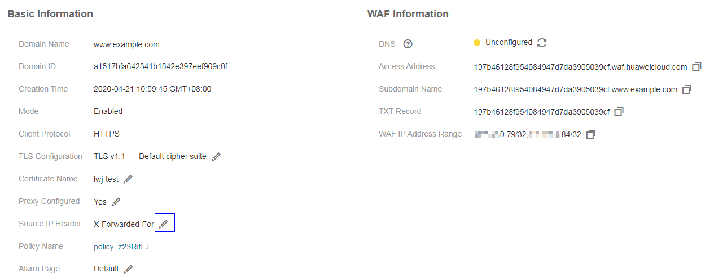

# How Do I Obtain the Real IP Address of a Web Visitor After WAF Is Enabled?

Generally, a proxy such as CDN, WAF, and AAD is deployed between the client and server. Web visitors cannot directly access the server. For example,  **web visitor**  \>  **CDN/WAF/AAD**  \>  **origin server**. Then, how does the server obtain the real IP address of the client when multiple proxies are used?

1.  Log in to the management console.
2.  Click    in the upper left corner of the management console and select a region or project.
3.  Click  **Service List**  at the top of the page and choose  **Security**  \>  **Web Application Firewall**. In the navigation pane, choose  **Domains**. The  **Domains**  page is displayed, as shown in  [Figure 1](#en-us_topic_0154713166_f6b9e0be38f9b4498a46fea967ef351ae).

    **Figure  1**  Domains page  
    

4.  In the  **Name**  column, click the target domain name to go to the basic information page.
5.  View  **Source IP Header**. By default, WAF obtains the real IP address of a web visitor from the HTTP header  **X-Forwarded-For**. The first IP address in the  **X-Forwarded-For**  field is the real IP address of the web visitor. You can also click    to customize the field to identify the real IP address. See  [Figure 2](#fig41979345127).

    **Figure  2**  Basic domain information  
    

